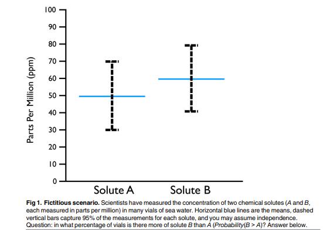
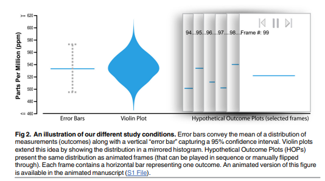
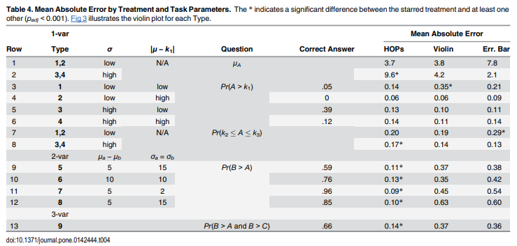
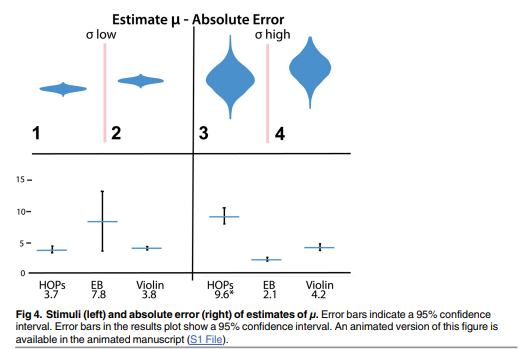
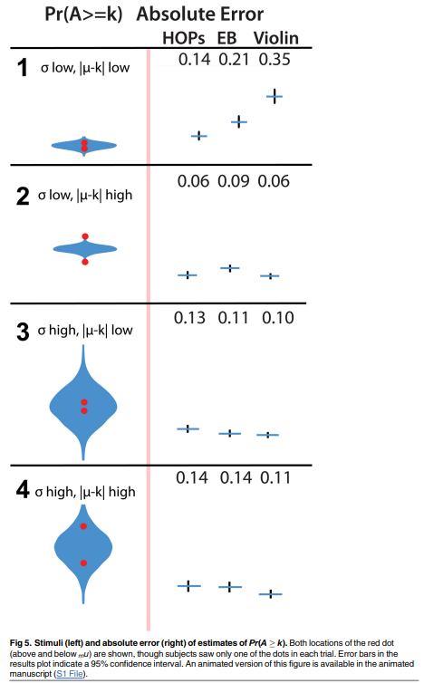
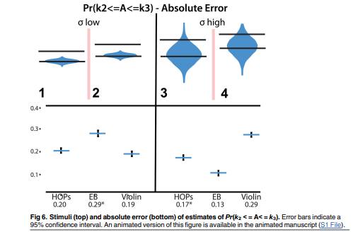
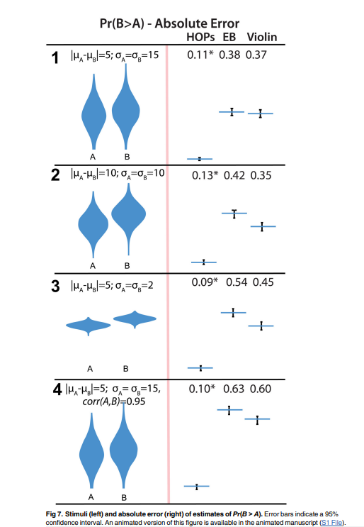
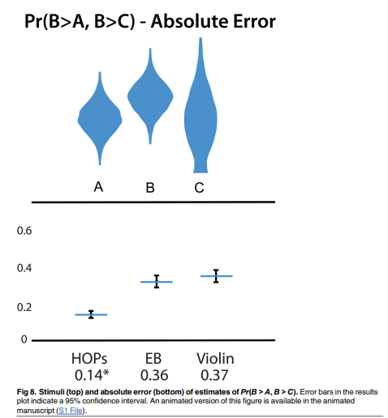
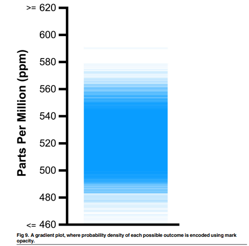

# Detailed Overview: *Hypothetical Outcome Plots Outperform Error Bars and Violin Plots for Inferences about Reliability of Variable Ordering*

**Article:** Jessica Hullman, Paul Resnick, and Eytan Adar. 2015. *Hypothetical Outcome Plots Outperform Error Bars and Violin Plots for Inferences about Reliability of Variable Ordering.* PLOS ONE, 10(11): e0142444.  
**Core topic:** Uncertainty visualization, probability distributions, animated hypothetical outcomes, graphical inference.  
**Main claim:** Hypothetical Outcome Plots (HOPs), which animate individual sampled outcomes from a distribution, help viewers make more accurate judgments about the reliability of variable ordering than error bars or violin plots, especially for two-variable and three-variable comparisons.

---

## 1. Big-Picture Summary

This article investigates how people interpret visualizations of uncertainty. Many common uncertainty visualizations, especially **error bars**, are widely used but often misunderstood. Even statistically trained viewers may draw incorrect conclusions from them. The authors introduce and test **Hypothetical Outcome Plots (HOPs)** as an alternative.

A HOP displays uncertainty by showing a sequence of possible outcomes, one at a time, usually as an animation. Instead of asking viewers to mentally decode an abstract summary of a probability distribution, HOPs let viewers observe many possible outcomes and reason through counting, visual comparison, and repeated exposure.

The authors compare three visualization types:

1. **Error bars** — static interval around a mean.
2. **Violin plots** — static density-based representation of a distribution.
3. **Hypothetical Outcome Plots** — animated frames, where each frame shows one sampled outcome.

The key experimental finding is that HOPs dramatically outperform error bars and violin plots when viewers must judge **how reliably one variable is larger than another**, such as estimating `Pr(B > A)` or `Pr(B > A and B > C)`. For simple one-variable tasks, HOPs are mostly comparable to static representations, though they perform worse when estimating the mean of a high-variance distribution.

---

## 2. Motivation: Why Uncertainty Visualization Is Hard

The article begins with a simple but revealing example: viewers are shown two distributions for chemical solutes A and B and asked to estimate the probability that B is greater than A.

Although the correct probability is approximately **75%**, more than half of viewers in the authors’ preliminary example underestimated it by about **50 percentage points**, often guessing around 20% or 25%.

This motivates the central problem:

> Static uncertainty depictions often show the information needed for correct reasoning, but they do not necessarily make that information cognitively usable.

### Why Error Bars Are Difficult

Error bars are common, but they require viewers to understand several statistical ideas:

- What the central line represents, such as mean or median.
- What the interval represents, such as standard deviation, confidence interval, or 95% coverage.
- How overlap between intervals should and should not be interpreted.
- How to infer probabilities from interval information.
- How to compare multiple distributions jointly.

The article emphasizes that error bars can lead to incorrect heuristics. For example, viewers may assume that overlapping error bars always imply no meaningful difference, or that values inside the error bar are uniformly likely.

### Why Violin Plots Help but Still Have Limits

Violin plots encode a distribution’s density through width. Wider regions represent more probable values. They show more about the distributional shape than error bars do.

However, violin plots still require viewers to understand an abstract visual encoding. To answer probability questions, users must estimate areas visually, which becomes difficult when comparing multiple variables.

---

## 3. What Are Hypothetical Outcome Plots?

A **Hypothetical Outcome Plot** shows a finite sequence of sampled outcomes from a distribution. Each frame represents one possible outcome.

For a single variable, one frame may show one horizontal bar at the sampled value. For multiple variables, one frame may show sampled values for A, B, and C at the same time. A viewer can then observe whether B is above A, whether B is the largest, and so on.

### Basic Construction of HOPs

The article describes the HOP procedure as:

1. Draw a sample of hypothetical outcomes from the distribution.
2. Create one plot for each sampled outcome.
3. Present those plots as frames in an animation.
4. Keep the visual mapping stable across frames so viewers can compare outcomes consistently.

### Why HOPs May Be Easier to Interpret

HOPs shift reasoning from abstract probability to concrete frequency. Instead of asking:

> “What is the probability that B is greater than A?”

The viewer can ask:

> “How often do I see B above A in the animation?”

This makes the task closer to counting or estimating relative frequency, which many people find easier than interpreting probability distributions.

### Main Advantages

- They present **individual outcomes**, not just summary statistics.
- They allow viewers to reason in terms of **counts and frequencies**.
- They avoid requiring viewers to understand extra marks such as error bars or density widths.
- They can naturally show **joint outcomes**, including correlated variables.
- They are especially useful when the task involves comparing variables, such as identifying how often one value exceeds another.

### Main Drawbacks

- They introduce **sampling error**, because viewers only see a finite number of frames.
- They require viewers to integrate information over time.
- They depend on animation speed, interaction design, and visual stability.
- They may be harder to use in static media such as print.

---

## 4. Key Visual Comparison from the Article

The article compares error bars, violin plots, and HOPs using the same underlying distributions.




**What this page shows:**  
Figure 1 illustrates the motivating solute example where viewers estimate whether B exceeds A. Figure 2 compares the three experimental visualization conditions: error bars, violin plots, and selected frames from a HOP animation.

---

## 5. Related Work

The article situates HOPs within broader research on uncertainty visualization.

### 5.1 Static Probability Distribution Displays

Static displays include:

- Error bars
- Confidence intervals
- Box plots
- Modified box plots
- Violin plots
- Gradient plots
- Shaded uncertainty plots

These displays can be compact and publication-friendly, but they often require statistical literacy and familiarity with the encoding.

### 5.2 Multiple Individual Outcome Displays

The article connects HOPs to prior work that visualizes multiple possible outcomes, including:

- Bootstrapped rainfall examples
- Animated uncertainty maps
- Spatial model uncertainty visualizations
- Simulation-based displays in journalism
- Graphical inference lineups
- Statistics education tools such as “dance of the means”

The authors argue that HOPs generalize these ideas by applying animated individual outcomes to probability distributions more broadly, not only to null hypothesis testing or educational demos.

---

## 6. Study Design

The authors conducted a user study using Amazon Mechanical Turk. Participants were randomly assigned to one visualization condition:

- HOPs
- Error bars
- Violin plots

Each participant completed nine tasks:

- Four one-variable tasks
- Four two-variable tasks
- One three-variable task

The authors measured performance using **absolute error**, meaning the absolute difference between the participant’s answer and the correct answer.

---

## 7. Experimental Apparatus

All values were drawn from normal distributions. The study used a chemical-solute framing to keep the tasks concrete:

> Scientists measured chemical solute concentrations in seawater vials. Participants viewed plots based on those measurements and answered questions about them.

A key design choice is that the plots represented the **underlying distribution of measurements**, not sampling distributions or confidence intervals around sample means. This avoided confusion about statistical inference and focused the study on visual interpretation.

### Error Bar Instructions

Participants were told that the blue line represented the average amount of solute and the dashed lines represented a range containing 95% of collected vials.

### Violin Plot Instructions

Participants were told that the width of the colored area at each level showed how many seawater vials had that amount of solute.

### HOP Instructions

Participants were told that each plot showed the quantity of solute in one vial of seawater. They could play, pause, or step through the animation.

The HOP animation advanced every **400 milliseconds** and looped after **5,000 frames**. Participants could manually control the animation.

---

## 8. One-Variable Tasks

Each participant completed four trials involving a single random variable A.

They answered three questions per trial:

1. What is the average measurement?
2. How often are measurements above the red dot?
3. How often do measurements lie between two given thresholds?

The authors varied:

- Standard deviation: low or high.
- Distance between the mean and the threshold: small or large.
- Whether the threshold was above or below the mean.

### One-Variable Distribution Types

| Type | Standard Deviation | Distance from Mean to Threshold | Example Target Probability |
|---|---:|---:|---:|
| 1 | 3 | 5 | 5% |
| 2 | 3 | 20 | 0% |
| 3 | 17 | 5 | 39% |
| 4 | 17 | 20 | 12% |

The one-variable tasks tested whether HOPs could support basic distributional reasoning, not just comparisons between variables.

---

## 9. Two-Variable Tasks

Participants then completed four trials involving variables A and B.

The question was:

> How often is the measurement of solute B larger than the measurement of solute A?

This corresponds to estimating:

```text
Pr(B > A)
```

The authors varied the means, standard deviations, and correlation structure.

### Two-Variable Distribution Types

| Type | μA | σA | μB | σB | Correlation | Correct Pr(B > A) |
|---|---:|---:|---:|---:|---:|---:|
| 5 | 40 | 15 | 45 | 15 | 0 | 59% |
| 6 | 50 | 10 | 60 | 10 | 0 | 76% |
| 7 | 80 | 2 | 85 | 2 | 0 | 96% |
| 8 | 55 | 15 | 60 | 15 | 0.95 | 85% |

The correlated case is especially important because error bars and violin plots, as shown in the study, do not convey the correlation between A and B. HOPs can show correlated outcomes because each frame displays joint draws.

---

## 10. Three-Variable Task

The final task involved three variables: A, B, and C.

Participants estimated:

```text
Pr(B > A and B > C)
```

The correct answer was **66%**.

This task tested whether viewers could judge whether B was the largest among three possible outcomes.

---

## 11. Hypotheses

The authors proposed four main hypotheses.

### Hypothesis 1: Mean Estimation

For estimating the mean of a single variable, error bars and violin plots should outperform HOPs when variance is high, because the HOP viewer must integrate many moving frames.

Expected result:

- Low variance: little difference across visualization types.
- High variance: HOPs worse for estimating the mean.

### Hypothesis 2: Cumulative Probability Estimation

For estimating probabilities above a threshold or between two thresholds, violin plots should outperform HOPs and error bars because violin plots directly encode distributional density.

### Hypothesis 3: Two-Variable Ordering

For estimating `Pr(B > A)`, HOPs should outperform both error bars and violin plots because HOPs allow direct frame-by-frame comparison.

### Hypothesis 4: Three-Variable Ordering

For estimating `Pr(B > A and B > C)`, HOPs should outperform both error bars and violin plots because viewers can directly observe whether B is largest in each frame.

---

## 12. Study Results: Overview

The results strongly support the article’s central argument.

### Main Findings

- HOPs performed much better than error bars and violin plots for two-variable ordering tasks.
- HOPs performed much better than error bars and violin plots for the three-variable ordering task.
- For one-variable tasks, performance was more mixed.
- HOPs were worse for estimating the mean when variance was high.
- Violin plots did not consistently outperform HOPs or error bars on cumulative probability tasks, contrary to Hypothesis 2.

---

## 13. Result Table and Mean Estimation




**What this page shows:**  
Table 4 summarizes mean absolute error across tasks and visualization conditions. Figure 4 focuses on estimating the mean. HOPs had higher error for high-variance mean estimation, while static plots performed better there.

### Mean Estimation Results

For low-variance distributions, there was no significant difference in mean absolute error across visualization conditions. For high-variance distributions, HOP viewers had significantly higher error than viewers using error bars or violin plots.

This supports Hypothesis 1.

---

## 14. Probability Above a Threshold



**What this page shows:**  
Figure 5 compares participant errors when estimating the probability that A exceeds a threshold. The results were mixed and did not consistently favor violin plots.

### Key Point

The authors expected violin plots to be best because they encode density as area. However, the results provided little support for this. In one low-variance condition, violin plots actually produced higher error.

This weakens Hypothesis 2.

---

## 15. Probability Between Two Thresholds



**What this page shows:**  
Figure 6 compares performance on estimating the probability that A falls between two threshold values. Again, no single visualization clearly dominates across all cases.

### Key Point

Error bars performed worse in one low-variance condition, while HOPs performed worse in a high-variance condition. The authors suggest that compressed visual regions may have made some static displays difficult to read precisely.

---

## 16. Two-Variable Ordering: The Major Result



**What this page shows:**  
Figure 7 presents the most important result: HOPs produced far lower absolute error than error bars or violin plots when participants estimated how often B was greater than A.

### Mean Absolute Error for `Pr(B > A)`

| Distribution Type | Correct Answer | HOPs MAE | Violin MAE | Error Bar MAE |
|---|---:|---:|---:|---:|
| 5 | 59% | 0.11 | 0.37 | 0.38 |
| 6 | 76% | 0.13 | 0.35 | 0.42 |
| 7 | 96% | 0.09 | 0.45 | 0.54 |
| 8 | 85% | 0.10 | 0.63 | 0.60 |

These differences were statistically significant. HOPs dramatically improved accuracy for estimating the reliability of variable ordering.

This strongly supports Hypothesis 3.

### Why HOPs Helped

In HOPs, viewers could directly observe whether B was above A in each frame. With error bars and violin plots, participants had to mentally combine two distributions, which many could not do accurately.

The correlated case was particularly difficult for static plots because they did not show the relationship between A and B. HOPs could show correlated draws frame by frame.

---

## 17. Three-Variable Ordering



**What this page shows:**  
Figure 8 shows that HOPs again produced substantially lower error when participants estimated how often B was greater than both A and C.

### Three-Variable Result

| Task | Correct Answer | HOPs MAE | Violin MAE | Error Bar MAE |
|---|---:|---:|---:|---:|
| `Pr(B > A and B > C)` | 66% | 0.14 | 0.37 | 0.36 |

This strongly supports Hypothesis 4.

---

## 18. Discussion: Why the Results Matter

The authors argue that the experiment was relatively favorable to static representations:

- The distributions were normal.
- The violin plots were symmetric.
- Error bars were used in a simple, familiar setting.
- The tasks involved simple one-, two-, and three-variable distributions.

Even under these favorable conditions, HOPs greatly outperformed static representations for multivariate ordering judgments.

### Poor Static-Plot Performance

The authors emphasize that error bars and violin plots performed very poorly on ordering tasks. For example, in some two-variable tasks, mean absolute error exceeded 36 percentage points. Many participants gave implausible answers, including values below 50% when B’s mean was larger than A’s mean.

This suggests that participants often did not know how to use static distribution displays to estimate comparative probabilities.

### Why HOPs Worked Better

HOPs made the comparison task perceptually direct:

- In each frame, compare A and B.
- Count or estimate how often B is larger.
- Convert that observed frequency into a probability judgment.

This approach reduces the burden of mentally reconstructing a joint distribution from abstract summary marks.

---

## 19. Precision of Inference from HOPs

A limitation of HOPs is that viewers only see a finite sample of outcomes. The article discusses how this creates sampling variability.

### Estimating a Mean

If a viewer sees `n` frames from a distribution with standard deviation `σ`, the precision of the sample mean is approximately:

```text
σ / sqrt(n)
```

Seeing more frames improves precision, but with diminishing returns. For example, seeing 100 frames instead of 25 cuts the confidence interval roughly in half, not by a factor of four.

### Estimating a Probability

For estimating a probability such as `Pr(X > k)`, if the true probability is `p`, the standard deviation of the estimated proportion after `n` frames is:

```text
sqrt(p(1 - p) / n)
```

This means probability estimates from HOPs become more precise as viewers observe more frames.

---

## 20. Frame Rate and Interactivity

The authors used a frame rate of **400 milliseconds per frame**, based on pilot testing. This rate was intended to be slow enough for viewers to process and count but fast enough to support integration across frames.

The article notes a tradeoff:

- Faster frame rates allow viewers to see more samples quickly.
- Slower frame rates make it easier to inspect each frame.
- Interactive controls let users adapt the display to their own strategy.

The authors suggest future work should systematically test frame rates and interactivity.

---

## 21. HOPs Compared with Gradient Plots



**What this page shows:**  
Figure 9 shows a gradient plot, where probability density is encoded by mark opacity. The authors compare this to HOPs by describing HOPs as encoding density through “blink rate,” meaning values that occur more often appear more often across frames.

### Important Concept

At very high animation speeds, HOPs may begin to resemble a static gradient plot because repeated outcomes visually blend together. However, if animation becomes too fast, viewers may lose the ability to count or compare individual outcomes.

---

## 22. Extensions and Variations of HOPs

The authors describe several possible extensions.

### 22.1 Adjustable Frame Rates

Users could speed up or slow down the animation depending on their task. Slower rates may help with counting, while faster rates may help with judging variability.

### 22.2 Interactive Annotations

Viewers could draw threshold lines or intervals to help estimate probabilities, such as the proportion of frames above a cutoff.

### 22.3 Small Multiples

Instead of animating outcomes over time, many hypothetical outcomes could be displayed at once as small multiples. This would shift integration from time to space.

The tradeoff is that small multiples require much more screen space and may become visually overwhelming.

### 22.4 Better Sampling and Frame Ordering

The authors note that the process used to generate hypothetical outcomes must match the inferential goal. For more complex plots, maintaining visual stability and deciding how to order frames become important design decisions.

### 22.5 Combined Representations

HOPs could be combined with static uncertainty displays. For example, an animated HOP could be overlaid on a violin plot or error bar to help viewers understand what the static display means.

---

## 23. Limitations

The authors identify several limitations.

### 23.1 Mechanical Turk Sample

The study used Mechanical Turk participants. These participants may not represent all audiences. They may also be more numerate than the general population.

### 23.2 Task Scope

The study focused on relatively simple tasks involving one, two, or three variables. More complex visualizations may create additional challenges.

### 23.3 Underlying Distribution Framing

The study framed plots as observed distributions of solute measurements, not sampling distributions or confidence intervals. Future work should test HOPs in more formal statistical inference contexts.

### 23.4 Static Alternatives

The study compared HOPs only with error bars and violin plots. Other static representations may perform better.

### 23.5 Tailored Visualizations

The authors did not test customized displays designed specifically to answer the comparison question, such as plotting `B - A` directly. They focused on general-purpose distribution representations.

### 23.6 Cognitive Strategy Unknowns

The study did not ask participants to explain their reasoning. As a result, the authors cannot say exactly whether participants counted, estimated, averaged, or used another strategy.

---

## 24. Practical Implications

This article is highly relevant for data visualization, uncertainty communication, and dashboard design.

### When HOPs Are Especially Useful

HOPs are useful when the audience needs to understand:

- How often one uncertain quantity exceeds another.
- Whether a ranking or ordering is reliable.
- How uncertainty affects comparisons.
- Joint uncertainty across multiple variables.
- Correlated outcomes.

### When Static Plots May Still Be Better

Static plots may be preferable when:

- The medium is print.
- The task is simply estimating a mean.
- The distribution must be inspected in detail at a specific point.
- Animation would distract or overload the viewer.
- The audience needs a compact summary.

### Relevance to Uncertainty Communication

The article supports a broader principle:

> Uncertainty visualizations should match the viewer’s reasoning task, not just encode statistically complete information.

Error bars and violin plots may technically contain enough information, but users may not be able to extract the needed inference. HOPs can make some inferences more perceptually direct.

---

## 25. Key Terms

### Hypothetical Outcome Plot (HOP)

An animated visualization showing a sequence of possible outcomes sampled from a probability distribution.

### Error Bar

A static interval around a central value. In this study, error bars showed a range covering 95% of the underlying distribution.

### Violin Plot

A plot that shows the shape of a distribution by encoding density as width.

### Mean Absolute Error (MAE)

The average absolute distance between participant estimates and correct answers. Lower MAE means better accuracy.

### Cumulative Distribution Function (CDF)

A function describing the probability that a random variable falls below or within certain values.

### Joint Distribution

A probability distribution describing multiple variables together, including possible relationships between them.

### Variable Ordering

A relationship such as whether B is greater than A, or whether B is greater than both A and C.

---

## 26. Strongest Takeaways

1. **HOPs are especially effective for comparing uncertain quantities.**  
   They substantially improved accuracy for estimating `Pr(B > A)` and `Pr(B > A and B > C)`.

2. **Static uncertainty displays can be statistically complete but cognitively difficult.**  
   Error bars and violin plots contained information, but participants struggled to use them for multivariate probability judgments.

3. **Frequency-based reasoning is powerful.**  
   HOPs let viewers think in terms of “how often this happens” rather than abstract probability density.

4. **HOPs are not universally superior.**  
   They were worse for estimating the mean of high-variance univariate distributions.

5. **Interactivity matters.**  
   Pause, play, step-through controls, frame numbers, and adjustable speed may improve users’ ability to reason with HOPs.

6. **The main design lesson is task alignment.**  
   Visualizations should make the target inference easy to perform, not merely encode all relevant data.

---

## 27. How This Article Connects to Presenting Uncertainty

For a course or project on presenting uncertainty, this article is important because it shows that uncertainty communication is not only about statistical correctness. It is also about whether viewers can make accurate inferences from the visual form.

The article provides evidence against relying too heavily on traditional error bars, especially when audiences must compare uncertain values. It also shows the value of using animated or simulation-based approaches when communicating probabilistic outcomes.

A useful classroom summary would be:

> HOPs work well because they transform uncertainty from an abstract distribution into a sequence of concrete possible worlds.

---

## 28. Possible Discussion Questions

1. Why might viewers misinterpret error bars even when the caption explains them?
2. Are HOPs more useful for lay audiences, expert audiences, or both?
3. When does animation improve uncertainty communication, and when might it distract?
4. Would HOPs still outperform violin plots if viewers received more training?
5. How might HOPs be adapted for dashboards, forecasting, or public-health communication?
6. Should uncertainty visualizations prioritize exact statistical encoding or ease of inference?
7. How could HOPs be combined with static plots to support both overview and detailed inspection?

---

## 29. Suggested Use Cases

HOPs could be useful in:

- Weather forecasts
- Election forecasts
- Medical risk communication
- Clinical outcome predictions
- Model uncertainty dashboards
- A/B testing results
- Ranking systems
- Budget or staffing forecasts
- Simulation-based planning
- Educational tools for probability and statistics

They are especially useful when users need to understand **how reliable an ordering or comparison is**, not just the uncertainty around one number.

---

## 30. Concise Final Summary

Hullman, Resnick, and Adar argue that traditional static uncertainty displays often fail because they require users to perform difficult mental transformations. HOPs offer a dynamic alternative by showing sampled possible outcomes one at a time. In the authors’ experiment, HOPs performed similarly to static plots for many one-variable tasks and dramatically better for two- and three-variable ordering tasks. The results suggest that animated, concrete depictions of uncertainty can help people make more accurate probabilistic judgments, especially when comparing uncertain quantities.
