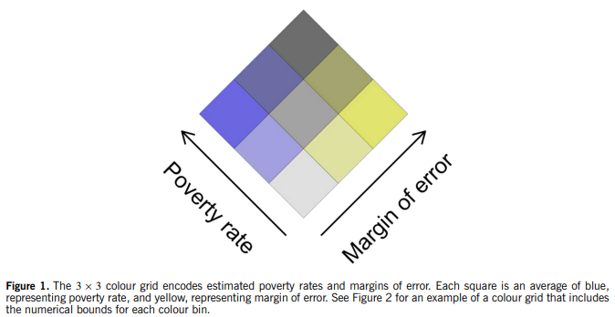
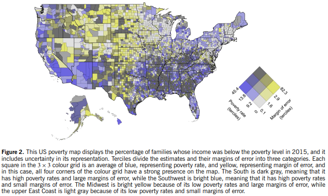
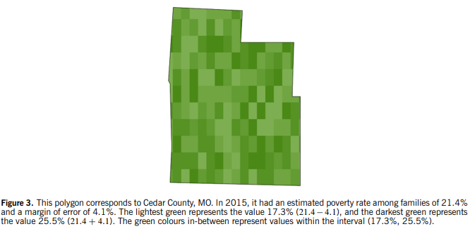
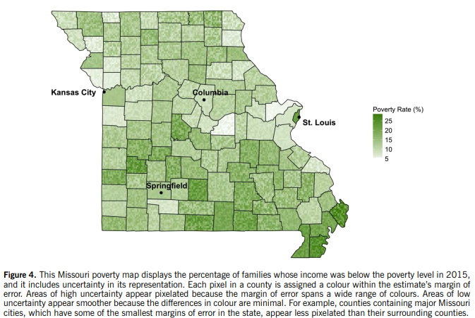
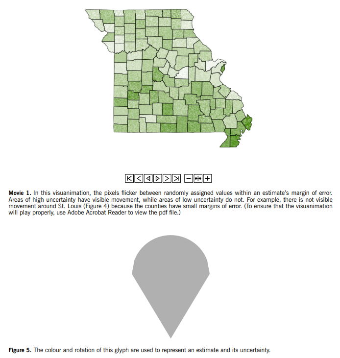
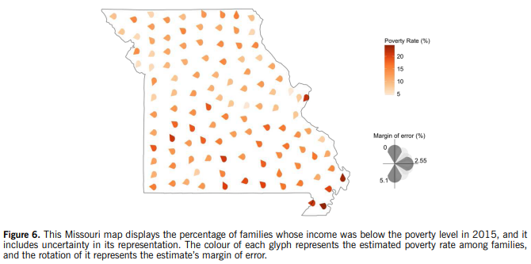

# Detailed Overview: *Visualizing Uncertainty in Areal Data with Bivariate Choropleth Maps, Map Pixelation and Glyph Rotation*

**Article:** Lydia R. Lucchesi & Christopher K. Wikle. “Visualizing uncertainty in areal data with bivariate choropleth maps, map pixelation and glyph rotation.” *Stat*, 2017, 6:292–302. DOI: 10.1002/sta4.150  
**Core topic:** Uncertainty visualization for areal/spatial data, especially county-level choropleth maps using American Community Survey estimates and margins of error.

---

## 1. High-Level Summary

Lucchesi and Wikle argue that uncertainty is essential for correctly interpreting statistical estimates, but it is often omitted from maps of areal data. Standard choropleth maps usually show a single estimate per region, such as county poverty rate, using color. This can make the estimates look equally reliable even when some counties have very large margins of error and others have very small ones.

The article proposes and demonstrates **three map-based methods** for showing both an areal estimate and its uncertainty:

1. **Bivariate choropleth maps** repurposed to show an estimate and its margin of error together.
2. **Map pixelation**, where each county is filled with small pixels representing values inside the estimate’s margin of error.
3. **Glyph rotation**, where each county is represented by a same-sized glyph placed at the county centroid; color encodes the estimate and rotation encodes uncertainty.

The article uses **2015 American Community Survey poverty-rate estimates** and their corresponding **margins of error** as the main demonstration case. The authors do not present a user study; instead, they develop visualization methods, explain their rationale, show examples, and call for empirical testing as future work.

---

## 2. Problem the Article Addresses

### 2.1 Why uncertainty matters in maps

Areal data estimates often come from surveys or models and therefore contain uncertainty. If a map shows only the estimate, viewers may assume the mapped values are precise. This is misleading because two counties can have similar-looking estimates but very different reliability.

The article uses an ACS example to illustrate this point:

- **Kenedy County, Texas** had an estimated family poverty rate of **20.0%**, but its confidence interval was wide: **7.5% to 32.5%**.
- **Los Angeles County, California** had an estimated family poverty rate of **14.3%**, but its confidence interval was extremely narrow: **14.2% to 14.4%**.

This comparison shows that a smaller, less populous county can have a much less reliable estimate because the survey sample is smaller. A map that treats both estimates as equally precise hides a critical part of the statistical information.

### 2.2 Why choropleth maps are difficult to extend

A choropleth map already uses geographic space and color:

- Latitude and longitude define location.
- Region boundaries define areal units, such as counties.
- Color typically encodes the statistical estimate.

Adding uncertainty is difficult because it introduces another variable into an already dense display. Previous uncertainty visualization methods have used texture, fog, blur, saturation, side-by-side maps, multiple realizations, animation, and other encodings. The authors’ contribution is to adapt three methods specifically for areal data estimates and margins of error.

---

## 3. Conceptual Background

### 3.1 The power of visual displays

The authors draw on Stephen Few and Edward Tufte to explain why maps are powerful. Humans can only hold a limited number of individual values in visual working memory, but a well-designed graphic condenses many values into a pattern that can be interpreted quickly. A county-level choropleth map can show thousands of values at once, allowing viewers to detect local, regional, and national patterns.

### 3.2 The uncertainty visualization challenge

The goal is not only to show where estimates are high or low, but also where estimates are more or less reliable. For ACS county data, this means simultaneously showing:

- The estimated value, such as poverty rate.
- The uncertainty measure, such as margin of error.
- The spatial pattern of both across counties.

### 3.3 Prior concerns about uncertainty maps

A recurring concern in uncertainty visualization is that adding uncertainty may clutter a map or make the main variable harder to interpret. The authors review earlier approaches, including:

- Texture or parallel-line overlays.
- Fog or blur to indicate uncertainty.
- Color saturation changes.
- Lower resolution for more uncertain areas.
- Multiple maps showing different realizations.
- Animation or flickering to show reliability.
- Glyph-based encodings.

The article builds on this prior work but repurposes and modifies these methods for county-level areal estimates.

---

## 4. Data and Demonstration Case

The article demonstrates the methods using **American Community Survey 5-year estimates** of the percentage of families below the poverty level in 2015. Each county-level estimate has a corresponding margin of error, which is used to represent uncertainty.

The methods are broadly applicable beyond ACS data. The authors note that the same approaches could be used for many types of areal spatial data or spatial model outputs where predictive error estimates are available.

---

## 5. Method 1: Bivariate Choropleth Map for Uncertainty Visualization

### 5.1 Basic idea

A bivariate choropleth map uses color to encode two variables at once. Historically, these maps were often used to display two substantive variables, such as death rate and population density. Lucchesi and Wikle repurpose this idea to show:

- **Variable of interest:** estimated poverty rate.
- **Uncertainty:** margin of error.

### 5.2 Why historical bivariate maps were controversial

Earlier bivariate choropleth maps, especially those produced in the 1970s, often used large color grids such as 4 × 4 schemes with many hues. These were criticized because viewers had difficulty remembering and interpreting the color key. User studies showed higher error rates for bivariate maps compared with separate univariate maps.

The authors do not reject bivariate maps entirely. Instead, they modify the design to make it simpler and more interpretable.

### 5.3 Design refinements in this article

The authors use several refinements:

- A smaller **3 × 3 color grid** instead of a larger grid.
- Two single-hue color palettes.
- A blended palette created by averaging RGB color components.
- A **45-degree rotation** of the color grid.
- Terciles to divide both estimates and margins of error into three categories.

In their example:

- **Blue** represents poverty rate.
- **Yellow** represents margin of error.
- Blended colors represent combinations of poverty rate and margin of error.
- Light gray indicates low poverty and low margin of error.
- Dark gray indicates high poverty and high margin of error.

### 5.4 Interpretation of the U.S. poverty map

The U.S. county map shows spatial clusters of both poverty and uncertainty.

Key examples from the article:

- The **South** appears dark gray, indicating **high poverty rates and large margins of error**.
- The **Southwest** appears bright blue, indicating **high poverty rates but small margins of error**.
- The **Midwest** appears bright yellow, indicating **low poverty rates but large margins of error**.
- The **upper East Coast** appears light gray, indicating **low poverty rates and small margins of error**.

### 5.5 Strengths

The bivariate choropleth method allows viewers to detect regional patterns in both the estimate and the uncertainty. Unlike the pixelation method, it also allows users to recover approximate numerical categories for both measures from the legend.

### 5.6 Limitations

Even with a simplified 3 × 3 grid, bivariate color schemes require careful legend reading. Viewers must learn how the color blending works. The method may still be cognitively demanding for users who are unfamiliar with bivariate map legends.

---

## 6. Method 2: Map Pixelation for Uncertainty Visualization

### 6.1 Basic idea

The second method uses pixelation to represent uncertainty. Each county is divided into many small pixels. Instead of assigning the entire county a single color based only on the point estimate, each pixel is randomly assigned a value within the county’s margin of error.

In effect:

- Counties with **small margins of error** appear smooth because pixel values are similar.
- Counties with **large margins of error** appear visibly pixelated because pixel values span a wider range.

### 6.2 How values are assigned

For each county:

- The lightest pixel color represents the estimate minus the margin of error.
- The darkest pixel color represents the estimate plus the margin of error.
- Intermediate colors represent values inside the confidence interval.

The article gives a concrete example using **Cedar County, Missouri**:

- Estimated family poverty rate: **21.4%**.
- Margin of error: **4.1%**.
- Lower bound: **17.3%**.
- Upper bound: **25.5%**.

The county is filled with green pixel colors corresponding to values between 17.3% and 25.5%.

### 6.3 Static pixelated map

The Missouri map demonstrates the method across counties. Counties containing major Missouri cities, such as St. Louis, Kansas City, Columbia, and Springfield, tend to appear smoother because they have smaller margins of error. Surrounding counties can appear more pixelated because their estimates are less certain.

### 6.4 Animated pixelation / visuanimation

The authors also present an animated version called a **visuanimation**. In this dynamic version, pixels flicker between randomly assigned values inside each county’s margin of error.

Interpretation:

- Areas with high uncertainty show visible movement.
- Areas with low uncertainty show little or no visible movement.

The article notes that the embedded animation requires Adobe Acrobat Reader to play correctly.

### 6.5 Strengths

Map pixelation makes uncertainty visually salient without requiring a separate color dimension or a complex legend. It can make highly uncertain areas feel visually unstable, which aligns with the concept being communicated.

The animated version is especially useful because flickering can emphasize where uncertainty is large.

### 6.6 Limitations

The pixelated map does not allow users to easily determine the exact margin of error. It communicates relative uncertainty more than precise uncertainty. The authors explicitly state that this method falls short compared with the bivariate choropleth and glyph rotation methods when the goal is to recover exact uncertainty quantities.

Another design issue is pixel size. If pixels are too large, viewers may incorrectly interpret different pixels as representing different locations inside the county, even though the estimate applies to the entire county.

---

## 7. Method 3: Glyph Rotation for Uncertainty Visualization

### 7.1 Motivation

A common critique of choropleth maps is that geographic area can distort perception. Large counties take up more visual space, even if they are sparsely populated, while small urban counties may be visually minimized despite containing many people.

The glyph method reduces this problem by removing county area as the main visual unit. Instead, each county is represented by a glyph placed at the county centroid.

### 7.2 Encoding strategy

Each county receives a same-sized glyph:

- **Glyph color** represents the estimated poverty rate.
- **Glyph rotation** represents the margin of error.

Because all glyphs have the same size, the map no longer visually emphasizes geographically large counties over smaller ones.

### 7.3 Why this glyph shape was chosen

The authors selected a non-circular glyph because rotation would be visible. A circle would look the same after rotation. The chosen glyph has substantial surface area, making its color easy to see, and its upright versus inverted orientation has an intuitive interpretation:

- Upright orientation suggests lower uncertainty.
- More rotated or inverted orientation suggests greater uncertainty.

### 7.4 Missouri glyph map interpretation

The Missouri glyph map shows poverty rate using glyph color and uncertainty using glyph rotation. The method helps reveal:

- Areas of similar uncertainty where glyphs align similarly.
- Areas of sharp contrast where neighboring counties have very different uncertainty levels.

The authors note that horizontally tipped glyphs in the middle of the map stand out as a cluster of similar uncertainty, while sharp contrasts in southeast Missouri highlight neighboring counties with important uncertainty differences.

### 7.5 Strengths

Glyph rotation allows the map to show estimate, uncertainty, and spatial trend while reducing the misleading influence of county geographic area. It also gives uncertainty a distinct visual channel separate from color.

### 7.6 Limitations

Glyph maps may be less geographically familiar than choropleth maps because the county shapes are no longer filled. The viewer must interpret rotation carefully, and the method may become cluttered in dense regions unless glyph placement and size are well controlled.

---

## 8. Comparison of the Three Methods

| Method | Estimate Encoding | Uncertainty Encoding | Best For | Main Limitation |
|---|---|---|---|---|
| Bivariate choropleth | Color dimension, such as blue intensity | Second color dimension, such as yellow intensity | Showing categorical combinations of estimate and uncertainty across all counties | Requires learning and interpreting a bivariate legend |
| Map pixelation | Base color scale for estimate | Degree of within-county pixel variation or flicker | Making uncertainty visually noticeable, especially dynamically | Does not provide exact margin-of-error values |
| Glyph rotation | Glyph color | Glyph angle/rotation | Reducing misleading emphasis from county geographic area | Rotation may be unfamiliar and needs clear legend support |

---

## 9. Key Contributions

The article contributes to uncertainty visualization in several ways:

1. It emphasizes that areal maps should not show estimates without uncertainty when those estimates vary in reliability.
2. It adapts bivariate choropleth mapping specifically for estimate-plus-uncertainty visualization.
3. It introduces a pixelation strategy where visible texture corresponds to the range of plausible values inside a margin of error.
4. It presents an animated version of pixelation as a visuanimation.
5. It introduces glyph rotation as a way to encode uncertainty while reducing the visual bias caused by large geographic areas.
6. It provides R code in the online supplement so users can reproduce and modify the maps.

---

## 10. Discussion and Implications

The article argues that maps are important in spatial statistics, but maps that omit uncertainty can lead to overconfident interpretations. This is especially important for survey-based data such as ACS estimates, where uncertainty varies substantially across counties.

The three methods demonstrate different design trade-offs:

- The bivariate choropleth map is more quantitative but requires legend interpretation.
- Pixelation is visually intuitive but less precise.
- Glyph rotation reduces geographic area bias but introduces a less conventional map form.

The authors frame these methods as exploratory contributions rather than final answers. Their goal is to demonstrate possibilities and motivate future testing.

---

## 11. Limitations and Future Research

The authors identify user studies as the next major step. The article does not empirically test whether viewers interpret the methods correctly or whether one method outperforms another for specific tasks.

Important future research questions include:

- Do users correctly understand the uncertainty encodings?
- Which method best supports accurate map-based judgments?
- Do users over-focus on uncertainty and under-focus on the estimate, or vice versa?
- How do these methods perform with different datasets, geographic scales, or uncertainty measures?
- Does animation improve interpretation enough to justify its complexity?
- Would glyph rotation work better on an equal-area cartogram or tile grid map?

---

## 12. Practical Takeaways for Data Visualization

For analysts and data scientists, the article offers several practical lessons:

- Do not map uncertain estimates as if they are exact values.
- Use uncertainty encodings that fit the task: precise lookup, pattern detection, or relative comparison.
- Be cautious with choropleth maps because large geographic areas can dominate perception.
- Consider bivariate legends when both estimate and uncertainty need approximate numerical interpretation.
- Consider texture, pixelation, or animation when the goal is to make uncertainty perceptually salient.
- Use glyphs when geographic area may mislead viewers.

---

## 13. Bottom-Line Conclusion

Lucchesi and Wikle’s article shows that uncertainty can be incorporated into areal maps in multiple visually meaningful ways. Their central argument is that uncertainty is not optional context: it is part of the estimate itself. For spatial estimates such as ACS poverty rates, a map that excludes uncertainty can mislead viewers by implying equal reliability across counties. The article’s three proposed methods—bivariate choropleth mapping, map pixelation, and glyph rotation—offer different ways to make uncertainty visible and interpretable.
