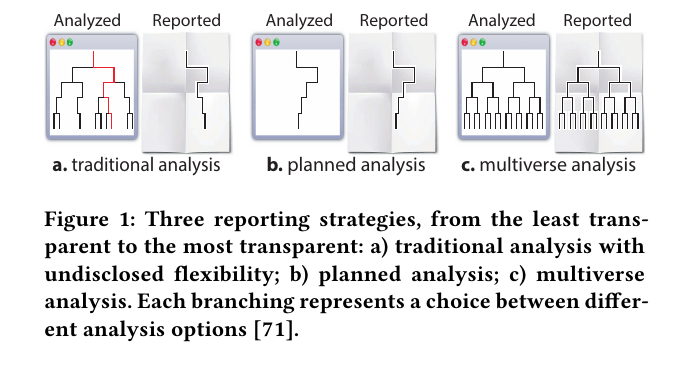
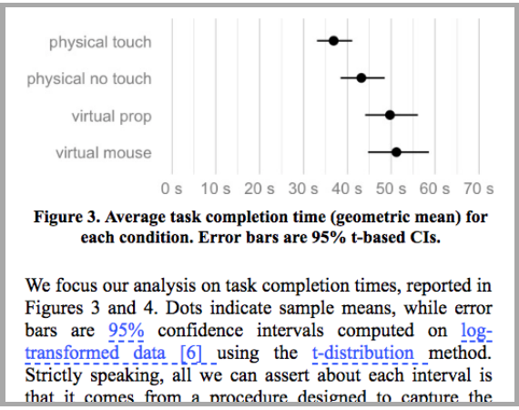
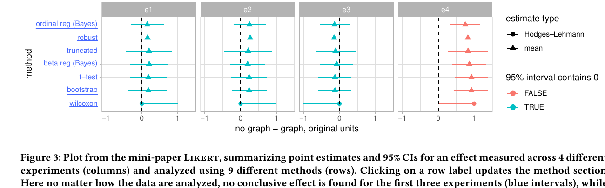
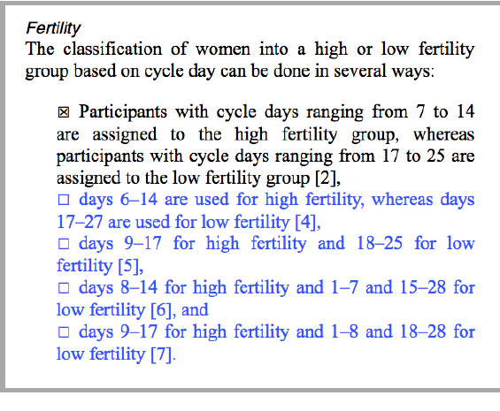
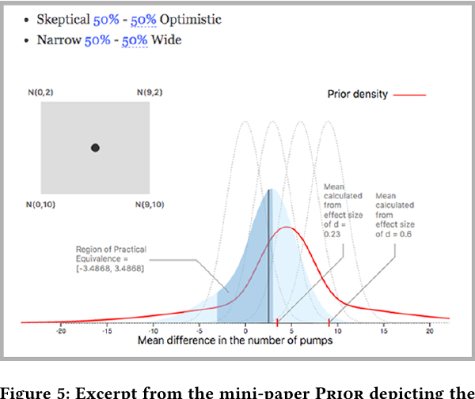
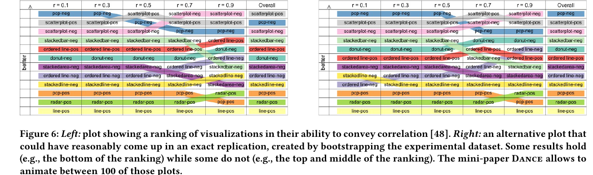

# Detailed Overview: *Increasing the Transparency of Research Papers with Explorable Multiverse Analyses*

**Authors:** Pierre Dragicevic, Yvonne Jansen, Abhraneel Sarma, Matthew Kay, and Fanny Chevalier  
**Venue:** CHI 2019, ACM Conference on Human Factors in Computing Systems  
**Core topic:** Transparent statistical reporting, multiverse analysis, interactive/explorable research papers, HCI publication design

---

## 1. High-Level Summary

This article proposes **explorable multiverse analysis reports**, abbreviated by the authors as **EMARs**, as a way to make statistical reporting in research papers more transparent.

The core idea is to combine two existing concepts:

1. **Multiverse analysis**: instead of reporting only one statistical analysis, researchers report many defensible analyses that differ in data-processing choices, model choices, priors, transformations, exclusion criteria, or presentation choices.
2. **Explorable explanations**: interactive narratives where readers can actively manipulate assumptions, parameters, or analysis choices and immediately see how the explanation changes.

The authors argue that research papers should be treated as a **user interface**. A traditional paper presents a fixed path through the analysis, while an EMAR lets readers interact with the results section itself. Readers can change assumptions or analytical choices in the paper and see updated plots, numbers, captions, or interpretations.

The article contributes:

- A conceptual proposal for **interactive multiverse reporting**.
- Five proof-of-concept mini-papers demonstrating different EMAR designs.
- A design space for thinking about how EMARs can be structured.
- A discussion of usability, review, publication, and tooling challenges.
- A broader argument that HCI can contribute to methodological reform by designing better interfaces for statistical communication.

---

## 2. Motivation: Why Transparent Statistical Reporting Matters

The paper begins from the broader context of the **replication crisis** in psychology, HCI, and human-subject research. Many findings have proven difficult to replicate, which has led researchers to call for more transparent statistical practices.

The authors identify **undisclosed flexibility** as one of the major sources of opacity in research reporting. Undisclosed flexibility occurs when researchers make many decisions during analysis but report only the final selected path. These decisions can include:

- Which participants to exclude.
- Whether and how to transform variables.
- Which model to use.
- Which covariates to include.
- Which outcome measure to emphasize.
- Which statistical threshold to use.
- Which plot or metric to present.

A single published analysis can therefore hide many unreported alternatives. This matters because different reasonable choices can sometimes lead to different conclusions.

The article contrasts three reporting strategies:

Figure 1: Three reporting strategies: traditional analysis, planned analysis, and multiverse analysis.

**Figure 1, from page 3 of the article**, compares three approaches:

1. **Traditional analysis with undisclosed flexibility**  
   Researchers may explore many analytical branches but report only one result.

2. **Planned analysis**  
   Researchers commit to one analysis path in advance, often through preregistration.

3. **Multiverse analysis**  
   Researchers report the full range of defensible analysis paths, making the analytical branching visible.

The authors do not reject planned analysis or preregistration. Instead, they argue that multiverse reporting can complement these approaches by showing whether findings are robust or fragile across reasonable analytical alternatives.

---

## 3. What Is Multiverse Analysis?

A **multiverse analysis** starts from the premise that data analysis is not a single inevitable pipeline. A researcher often faces many defensible choices. Each choice creates a branch. The combination of those branches creates a set of possible analyses: a “multiverse.”

For example, suppose a study has these choices:

- Use raw or log-transformed response times.
- Use a t-based confidence interval or a bootstrap confidence interval.
- Apply or do not apply a multiple-comparison correction.
- Use 90%, 95%, or 99% confidence intervals.

Even this small set yields many possible analysis combinations.

The purpose of multiverse analysis is not to find the “best” result or average away all uncertainty. Its purpose is to show:

- Whether a finding is stable across reasonable analytical decisions.
- Which decisions matter most.
- Whether the result depends on one arbitrary or controversial choice.
- Whether the evidence is strong, fragile, or genuinely ambiguous.

The authors position multiverse analysis as a response to the problem that static papers often collapse a complex analysis process into one polished result.

---

## 4. Why Static Multiverse Reports Are Still Limited

The authors acknowledge that existing multiverse papers already improve transparency by reporting multiple analyses, usually through supplementary material, tables, histograms, specification curves, or other summary plots.

However, static multiverse reports have limitations:

### 4.1 Supplementary Material Is Often Ignored

A complete multiverse analysis may be placed in supplementary files or code repositories. This supports reproducibility, but casual readers often do not inspect supplementary materials. The main paper still controls the reader’s interpretation.

### 4.2 Static Summaries Can Lose Detail

A multiverse may be summarized using p-value histograms, dot plots, or grids. These are useful overviews, but they often reduce each analysis to a single number, such as:

- A p-value.
- A point estimate.
- A confidence interval.
- A binary significant/non-significant decision.

This can discard important interpretive context, such as the details of a model, the meaning of a transformation, or the substantive consequences of a particular analytical choice.

### 4.3 Readers Cannot Easily Inspect Specific Alternatives

A reader may want to ask:

- What happens if I use the original exclusion rule but a different transformation?
- What if I believe a Bayesian prior should be skeptical rather than optimistic?
- What if I want to compare the default model to a nonparametric alternative?
- What if I want to understand one specific branch of the multiverse?

Static summaries are not well suited for this kind of focused exploration.

---

## 5. The Proposed Solution: Explorable Multiverse Analysis Reports

The authors propose **EMARs**, or **explorable multiverse analysis reports**.

An EMAR is a research-paper results section that can be read like a normal paper but also manipulated interactively. A reader can change analytical choices through embedded controls and observe updated text, numbers, captions, and figures.

An EMAR is designed to support two reading modes:

1. **Passive reading**  
   The paper should still make sense if the reader never interacts with it.

2. **Active exploration**  
   The reader can manipulate assumptions and see how conclusions change.

The goal is not to replace all traditional papers with fully interactive systems, but to show that interactivity can make statistical reporting more transparent, nuanced, and inspectable.

---

## 6. Related Work

The article situates EMARs in three areas of prior work.

### 6.1 Interactive Documents

The authors discuss a long history of interactive documents, including:

- Hypertext.
- Fluid documents.
- Documents with expandable definitions or supplemental content.
- Interactive explanations.
- Rich web-based journalism.
- Interactive scientific visualizations.

They draw especially on **Bret Victor’s explorable explanations**, where the reader can manipulate the assumptions embedded in a narrative.

### 6.2 Academic Publishing Beyond Static PDFs

The article notes that academic publishing remains heavily tied to static PDFs, even though many interactive publication ideas already exist. Examples include:

- Semantic publications.
- Interactive figures.
- Executable papers.
- Literate programming.
- Rich interactive narratives.
- Distill-style interactive machine learning articles.

The authors argue that research papers can become more than static containers of text and figures: they can become interactive tools for understanding an analysis.

### 6.3 Interactive Statistical Reports

The authors also connect EMARs to statistical education tools and reporting environments such as:

- R Shiny.
- R Markdown.
- Jupyter Notebook.
- Interactive statistics teaching tools.
- Dynamic visual explanations of uncertainty.

However, they distinguish EMARs from these tools because EMARs are not merely educational simulations. They are meant to report findings from actual empirical studies while exposing the analytical choices behind those findings.

---

## 7. The Five EMAR Examples

The authors created five short interactive mini-papers to explore the design space of EMARs. Each mini-paper reanalyzes a previously published study for which data and scripts were publicly available. The examples are not meant to be final products; they are proofs of concept.

The five examples are:

1. **Frequentist**
2. **Likert**
3. **Dataverse**
4. **Prior**
5. **Dance**

Each example emphasizes a different kind of analytical flexibility and a different interaction design strategy.

---

## 8. Example 1: Frequentist

### 8.1 Purpose

The **Frequentist** mini-paper reanalyzes a CHI study on physical visualizations. It demonstrates how EMARs can expose choices in a standard frequentist analysis using confidence intervals.

The default version of the mini-paper resembles the original analysis, but the reader can interactively change several analytical parameters.

### 8.2 Interactive Parameters

The reader can change:

- **Confidence level**, such as 50%, 95%, or 99.9%.
- Whether task completion times are analyzed as **transformed** or **untransformed** data.
- Whether intervals use a **t-distribution** or **BCa bootstrap** method.
- Whether pairwise comparisons are **corrected for multiplicity** using Bonferroni correction.

**Figure 2, from page 5 of the article**, shows how controls are embedded directly in the text. Blue text elements behave like interactive widgets. When the reader drags or clicks them, the analysis and the figure update.

### 8.3 Key Lesson

The Frequentist example shows that interactivity can help readers understand that statistical quantities such as 95% confidence intervals are not sacred or inevitable. The reader can see how interval width and interpretation change as assumptions change.

The mini-paper covers **56 unique analyses**. The authors report that the core findings are reasonably robust for confidence levels of 95% or lower, though the example also illustrates how stronger criteria can make evidence look less decisive.

---

## 9. Example 2: Likert

### 9.1 Purpose

The **Likert** mini-paper reanalyzes an InfoVis study involving responses to a single Likert-type item. This example focuses on a common methodological problem: there is no universal consensus on how Likert-type responses should be analyzed.

Different researchers may prefer:

- Parametric methods.
- Nonparametric methods.
- Frequentist methods.
- Bayesian methods.
- Methods based on means.
- Methods based on ordinal structure.
- Methods based on log-odds ratios.

### 9.2 Methods Compared

The Likert mini-paper analyzes four experiments using **nine different methods**. These include approaches such as:

- Wilcoxon tests.
- Bootstrap methods.
- t-tests.
- Beta regression.
- Bayesian beta regression.
- Truncated methods.
- Robust methods.
- Bayesian ordinal regression.

**Figure 3, from page 6 of the article**, summarizes point estimates and 95% intervals across four experiments and nine analysis methods. The figure shows that the first three experiments do not yield conclusive effects across methods, while the fourth experiment shows convincing evidence across methods.

### 9.3 Interaction Design

The reader can click a row label in the figure. This updates the methods section to explain the selected method and interpret the result.

This is an important design choice: the figure provides a compact multiverse overview, while the text gives detail only for the selected method.

### 9.4 Key Lesson

The Likert example shows how EMARs can support methodological pluralism. Instead of forcing authors to choose one method and defend it against all alternatives, the paper can show whether conclusions change across reasonable methods.

In this case, the findings are mostly consistent across analyses. This strengthens confidence in the result.

---

## 10. Example 3: Dataverse

### 10.1 Purpose

The **Dataverse** mini-paper reproduces part of Steegen et al.’s multiverse analysis of a controversial study on ovulatory cycles and voting behavior.

This example focuses on **data-processing choices**, such as:

- How to dichotomize a variable.
- How to classify fertility.
- How to handle relationship status.
- How to apply exclusion criteria.

### 10.2 Interactive Choice Lists

**Figure 4, from page 6 of the article**, shows an interactive list of defensible alternatives for classifying women into high- or low-fertility groups. The reader can choose one option, and the paper updates the resulting plot.

### 10.3 Scale of the Multiverse

The Dataverse mini-paper covers:

**5 × 2 × 3 × 3 × 2 = 180 unique analyses**

This mirrors the structure of Steegen et al.’s original multiverse example.

### 10.4 Key Lesson

The Dataverse example shows that a static p-value summary can demonstrate fragility, but an interactive report lets readers inspect specific analytical branches. A reader can ask: “What happens under this exact combination of defensible choices?”

This makes the multiverse more concrete. Instead of seeing only a distribution of p-values, readers can examine effect-size patterns and interaction plots for specific analytical decisions.

---

## 11. Example 4: Prior

### 11.1 Purpose

The **Prior** mini-paper reanalyzes a CHI study using Bayesian analysis. It examines how different choices of prior affect conclusions about incidental power poses and risk-taking behavior.

Bayesian models require priors. In many cases, several priors may be defensible:

- A skeptical prior centered near zero.
- An optimistic prior based on prior literature.
- A narrow prior reflecting strong prior confidence.
- A wide prior reflecting weak prior confidence.

### 11.2 Interactive Prior Manipulation

**Figure 5, from page 7 of the article**, shows an interface where readers can manipulate the prior along two dimensions: location and width. The figure updates the prior and posterior distributions dynamically.

### 11.3 Key Question Enabled by the EMAR

The Prior example helps readers ask:

> What would I have had to believe before seeing this study in order to believe there is a large effect here?

This is a powerful transparency function. Instead of silently imposing the author’s prior beliefs on the reader, the paper allows readers to explore how different prior commitments affect posterior conclusions.

### 11.4 Implementation Detail

The authors note that refitting Bayesian models interactively would be too slow. Instead, they pre-fit several models with different priors and use weighted mixtures to interpolate posterior distributions in real time.

This example is technically more complex than the others because it supports continuous interaction rather than choosing from a small discrete set of options.

---

## 12. Example 5: Dance

### 12.1 Purpose

The **Dance** mini-paper reanalyzes a visualization study about how people perceive correlations. This example differs from the others because the analysis procedure remains fixed, while the dataset changes.

The authors use **bootstrapping** to create 100 alternative datasets that could plausibly have appeared if the study had been replicated with different participants.

### 12.2 Bootstrap-Based “Dance of Plots”

**Figure 6, from page 8 of the article**, compares an original ranking plot with an alternative plot generated from a bootstrap dataset. Some parts of the ranking remain stable while others change.

The mini-paper lets readers animate through the bootstrap datasets. This produces a “dance of plots,” analogous to Geoff Cumming’s “dance of p-values,” but applied to full visualizations.

### 12.3 Connection to Hypothetical Outcome Plots

The Dance example resembles **hypothetical outcome plots**, which represent uncertainty through animated draws from a distribution. Rather than showing static error bars, the visualization shows how the whole plot might vary across plausible replications.

### 12.4 Key Lesson

The Dance example demonstrates that uncertainty is not limited to a single error bar or interval. Entire visual patterns can be uncertain. Interactive animation can help readers judge which patterns are stable enough to trust.

---

## 13. Implementation Approach

The authors implemented the mini-papers using web technologies rather than building a full authoring toolkit.

Their implementation uses:

- **HTML, CSS, and JavaScript**.
- **distill.js** for academic paper-style rendering and references.
- **PubCSS** styling for ACM SIGCHI-like layouts.
- A customized version of **Tangle**, Bret Victor’s JavaScript library for explorable explanations.
- Pre-generated figures for several examples.
- D3.js for real-time visualization in the Bayesian prior example.
- R scripts to generate plots and analysis outputs.
- Stan for Bayesian model fitting in the Prior example.

A pragmatic feature of the implementation is that many figures are precomputed rather than recomputed live. This makes interaction fast and reliable in the browser.

---

## 14. Design Space of EMARs

A major contribution of the article is a design space for EMARs. The design space helps authors think systematically about what kind of multiverse they want to expose and how readers should interact with it.

The authors divide EMAR design into two broad steps:

1. **Define the multiverse**: choose which analyses, assumptions, parameters, or outcomes to include.
2. **Design the report**: choose how those analyses should be presented in the paper.

---

## 15. Basic Multiverse Terminology

The authors use a **tree of analysis** metaphor.

### 15.1 Analysis Parameter

An **analysis parameter** is a decision point in the analysis tree. Examples include:

- Transformation type.
- Model type.
- Confidence level.
- Prior distribution.
- Exclusion rule.
- Dataset choice.

### 15.2 Analysis Option

An **analysis option** is one possible choice under a parameter. For example, if the parameter is “data transformation,” options might include:

- No transformation.
- Log transformation.
- Inverse transformation.

### 15.3 Analysis

An **analysis** is a full path through the tree: one complete combination of parameter choices.

For example:

> log transformation + t-based confidence interval + Bonferroni correction + 95% confidence level

is one analysis in the multiverse.

---

## 16. Types of Analysis Parameters

The authors classify analysis parameters by where they occur in the statistical pipeline.

### 16.1 Data Substitution Parameters

These allow the reader to switch between different raw datasets. These datasets can be:

- Actually collected datasets.
- Simulated datasets.
- Bootstrap-resampled datasets.

The Dance example uses this approach.

### 16.2 Data Processing Parameters

These involve different ways of preparing the same raw data before analysis, such as:

- Excluding participants.
- Dichotomizing variables.
- Transforming variables.
- Handling missing data.
- Choosing subgroup definitions.

The Dataverse example is centered on data-processing parameters.

### 16.3 Modeling Parameters

These involve different ways of analyzing the processed data, such as:

- Choosing between statistical models.
- Choosing frequentist or Bayesian approaches.
- Choosing covariates.
- Choosing priors.
- Choosing link functions.
- Choosing parametric or nonparametric procedures.

The Likert and Prior examples emphasize modeling parameters.

### 16.4 Presentation Parameters

These involve different ways of presenting or summarizing the analysis outcome, such as:

- Confidence level.
- Number of digits shown.
- Type of plot.
- Histogram bin size.
- Smoothing kernel.
- Whether to report p-values.
- Whether to show intervals or point estimates.

The Frequentist example includes confidence level as a presentation parameter.

---

## 17. Types of Analysis Options by Function

The authors also classify analysis options by why they are included.

### 17.1 Author-Consensual Options

These are options that all authors agree are reasonable and worth reporting. Their main purpose is to assess robustness.

Example: two equally defensible exclusion rules.

### 17.2 Author-Specific Options

These are options supported by some authors but not all. EMARs can allow multiple coauthors’ preferred analyses to coexist.

Example: one coauthor prefers a Bayesian model while another prefers a nonparametric frequentist model.

### 17.3 Anticipatory Options

These are options authors may not prefer but include because reviewers or readers may expect them.

Example: authors who dislike p-values may still include an option for p-values because many readers are familiar with them.

### 17.4 Educational Options

These options may not be serious candidates for the main analysis but are included to teach or clarify interpretation.

Example: allowing readers to change confidence intervals from 50% to 99.9% to see how interval width changes.

---

## 18. EMAR Content Terminology

The paper distinguishes between different kinds of content in an EMAR.

### 18.1 Analysis Explanations

These explain or justify an analysis. They may include:

- Method descriptions.
- Model rationale.
- Explanation of transformations.
- Explanation of priors.
- Details about exclusion criteria.

### 18.2 Analysis Outcomes

These communicate the results of an analysis. They may include:

- Plots.
- Tables.
- Numerical results.
- p-values.
- Confidence intervals.
- Posterior distributions.
- Figure captions.
- Interpretive statements.

In an EMAR, not all explanations and outcomes need to be visible at the same time. Some can appear only when a reader selects a particular analysis.

---

## 19. Default Analyses

A **default analysis** is the analysis visible when the reader first opens the article.

The authors explain that an EMAR can be designed along a continuum:

- At one end, it resembles a traditional single-analysis paper with hidden interactive alternatives.
- At the other end, it displays the full multiverse explicitly.

The choice has trade-offs.

A traditional-looking EMAR may be less intimidating and easier to read passively. However, it may hide the multiverse from readers who do not interact.

A fully explicit EMAR may be more transparent, but it can be visually dense and harder to read.

---

## 20. Multiplexing and Aggregation

The authors identify three strategies for presenting multiple analyses.

### 20.1 Space Multiplexing

**Space multiplexing** shows multiple analyses at the same time by placing them side by side or in a grid.

Advantages:

- Supports direct comparison.
- Gives an overview of the multiverse.
- Good for compact visual summaries.

Disadvantages:

- Requires more space.
- May reduce detail.
- Can become overwhelming.

The Likert example uses space multiplexing for outcomes.

### 20.2 Time Multiplexing

**Time multiplexing** shows different analyses in the same place at different times. The reader interacts with controls to switch between them.

Advantages:

- Saves space.
- Allows detailed analysis views.
- Supports animation and dynamic comparison.

Disadvantages:

- Harder to print.
- Harder to search.
- Readers may miss changes outside the viewport.
- The document may feel unstable if text or figures shift.

The Dataverse and Frequentist examples use time multiplexing.

### 20.3 Aggregation

**Aggregation** combines multiple analyses into a summary representation.

Examples:

- Histogram of p-values.
- Specification curve.
- Summary plot.
- Discussion paragraph summarizing robustness.

Advantages:

- Compact overview.
- Easier to communicate high-level robustness.
- Useful for conclusions.

Disadvantages:

- Can hide details.
- May collapse complex analyses into a single metric.

---

## 21. Controls in EMARs

Controls are interactive elements that let readers change analysis parameters.

### 21.1 In-Text Controls

In-text controls are embedded directly in the prose.

Advantages:

- Support narrative-guided exploration.
- Introduce choices at the exact point where they matter.
- Help readers understand what the parameter means.

Disadvantages:

- Controls may be scattered across the paper.
- Readers may not get an overview of all available parameters.
- Effects may occur far from the control.

### 21.2 Figure-Based Controls

Controls can also be embedded in or near figures.

Advantages:

- Keeps interaction close to visual outcomes.
- Supports exploratory analysis.
- Useful for compact parameter spaces.

Disadvantages:

- Easier to miss.
- Less integrated into the narrative.
- May require more interface knowledge from the reader.

### 21.3 Control Panels

The authors suggest that EMARs may benefit from control panels that gather multiple analysis parameters in one place, especially when there are many choices.

---

## 22. Narrative Design Principles

The authors emphasize that an EMAR must remain a coherent research paper, not just an interactive dashboard.

### 22.1 The Paper Must Make Sense at Any Frozen State

A reader should be able to stop interacting at any point and still see a coherent paper. The selected figures, captions, statistics, and prose should not contradict each other.

### 22.2 Avoid Overproducing Separate Interpretive Narratives

One option is to write different interpretations for every analysis branch, but this quickly becomes unmanageable. The authors recommend writing interpretations that are true across the multiverse whenever possible.

### 22.3 Focus on Robust Findings

A multiverse narrative should emphasize findings that hold across reasonable alternatives. If a finding is fragile, the paper should say so.

### 22.4 Explain Consequential Choices

If results vary across the multiverse, authors should identify which choices drive the variation.

This is one of the most important transparency benefits of EMARs: the paper can show not only that a result changes, but why it changes.

---

## 23. Discussion: Limitations and Challenges

The authors are careful to describe EMARs as a promising but unfinished approach. They discuss several challenges.

### 23.1 EMARs Are Still Hard to Author

Writing an EMAR requires more work than writing a single-analysis paper. Authors must:

- Define reasonable analytical alternatives.
- Run many analyses.
- Decide which parameters to expose.
- Design interactions.
- Maintain narrative coherence.
- Generate figures and outputs for multiple branches.

Even with better tools, some complexity is unavoidable.

### 23.2 EMARs Are Still Hard to Read

Readers may face cognitive and usability challenges:

- They may not know what to interact with.
- They may miss changes that occur outside the visible screen.
- They may have difficulty comparing non-adjacent states.
- They may need more statistical knowledge to interpret the multiverse.

The authors argue that EMARs should therefore be readable at two levels: a passive level and an exploratory level.

### 23.3 EMARs Are Hard to Review

Reviewers may struggle with interactive papers because the amount of content is theoretically much larger than in a static PDF. A single EMAR may contain many hidden or non-default analyses.

The authors suggest treating non-default analyses similarly to supplementary material, while still allowing reviewers to inspect them if needed.

### 23.4 EMARs Raise Publication Infrastructure Problems

If EMARs become common, publishers will need to address:

- Long-term preservation.
- Citation of specific analysis states.
- Accessibility for screen readers.
- Compatibility with archival systems.
- Whether papers should be standalone HTML documents or depend on live computational environments.
- How to review, index, and preserve interactive states.

### 23.5 EMARs Do Not Replace Preregistration

The authors stress that EMARs are compatible with preregistration. Researchers can preregister:

- A default analysis.
- The entire multiverse.
- Criteria for interpreting robustness.

Preregistration and multiverse analysis answer different transparency problems. Preregistration limits undisclosed flexibility before data analysis. Multiverse reporting exposes reasonable flexibility and its consequences.

---

## 24. Key Contributions of the Paper

The paper’s contributions can be summarized as follows:

### 24.1 It Reframes the Research Paper as a User Interface

Rather than treating papers as static artifacts, the authors argue that papers are interfaces through which readers inspect evidence.

### 24.2 It Extends Multiverse Analysis into Interactive Reporting

The paper does not merely advocate running many analyses. It asks how those analyses can be communicated effectively inside the research paper.

### 24.3 It Provides Concrete Examples

The five mini-papers demonstrate different EMAR patterns:

| Example | Main Flexibility Exposed | Main Interaction Pattern | Main Lesson |
|---|---|---|---|
| Frequentist | Confidence levels, transformations, interval types, correction methods | In-text controls | Common statistical defaults are adjustable choices |
| Likert | Alternative models for Likert-type data | Static overview + clickable methods | Robustness across methods can strengthen findings |
| Dataverse | Data-processing decisions | Interactive choice lists | Fragile findings can be inspected branch by branch |
| Prior | Bayesian prior choices | Continuous prior manipulation | Priors can be made transparent and reader-adjustable |
| Dance | Bootstrap-resampled datasets | Animated plot variation | Whole visual patterns can be uncertain |

### 24.4 It Defines a Design Space

The paper gives vocabulary for future EMAR research, including:

- Analysis parameters.
- Analysis options.
- Data substitution parameters.
- Data processing parameters.
- Modeling parameters.
- Presentation parameters.
- Author-consensual, author-specific, anticipatory, and educational options.
- Space multiplexing.
- Time multiplexing.
- Aggregation.
- In-text and figure-based controls.

### 24.5 It Identifies Adoption Challenges

The authors address practical barriers, including authoring effort, reading effort, review complexity, accessibility, and archival longevity.

---

## 25. Relationship to Steegen et al. on Multiverse Analysis

This article builds directly on Steegen et al.’s multiverse analysis work.

Steegen et al. argued that researchers should analyze all reasonable versions of a dataset to show whether findings are robust to arbitrary data-processing choices. Dragicevic et al. extend that idea by asking:

> How should a multiverse analysis be communicated to readers?

The Dataverse example is explicitly based on Steegen et al.’s reanalysis of Durante et al.’s ovulatory-cycle study. Where Steegen et al. use static summaries such as histograms and p-value grids, Dragicevic et al. propose interactive papers that let readers select analysis branches and inspect their consequences.

In this sense, the article shifts the focus from **methodological transparency** to **interface design for methodological transparency**.

---

## 26. Practical Implications for Researchers

For researchers, the article suggests several practical lessons.

### 26.1 Do Not Treat Analysis Choices as Invisible

Even when choices seem minor, they can affect results. Researchers should document and communicate important choices.

### 26.2 Use Multiverse Thinking During Analysis

Before reporting a result, researchers can ask:

- What reasonable alternatives did we have?
- Do conclusions change under those alternatives?
- Which choices are most consequential?
- Are we reporting a robust result or a fragile one?

### 26.3 Use Interaction When Static Summaries Are Insufficient

Static plots are useful, but interaction can help when readers need to inspect specific combinations of choices.

### 26.4 Write Conclusions That Survive the Multiverse

Rather than writing a conclusion around one preferred branch, researchers should write conclusions that remain valid across the reasonable analytical space.

### 26.5 Treat Transparency as a Communication Design Problem

Transparent statistics is not only about better methods. It is also about better interfaces, better narratives, and better reader support.

---

## 27. Practical Implications for HCI and Data Visualization

For HCI and visualization researchers, the paper is especially important because it shows how interface design can contribute to scientific reform.

Potential future work includes:

- Better EMAR authoring tools.
- Better interactive publication templates.
- Methods for summarizing large multiverses.
- Navigation aids for multiverse spaces.
- Linked views between controls, plots, and text.
- Accessibility standards for interactive papers.
- Ways to cite exact interactive states.
- Empirical studies on how readers interpret EMARs.
- Integration with R Markdown, Jupyter, Distill, Quarto, or other publishing systems.

The paper’s central HCI insight is that scientific evidence is not merely computed; it is **presented through an interface**. That interface can either hide or reveal analytical flexibility.

---

## 28. Strengths of the Article

### 28.1 Clear Conceptual Contribution

The article provides a clear and useful concept: the research paper as an interactive interface for multiverse analysis.

### 28.2 Concrete Demonstrations

The five mini-papers make the idea tangible. The paper does not remain abstract; it shows several working patterns.

### 28.3 Balanced View of Interactivity

The authors do not claim that interactivity solves everything. They recognize the cognitive, technical, review, and archival burdens of interactive papers.

### 28.4 Useful Design Vocabulary

The terminology and design space are valuable for anyone designing interactive statistical reports.

### 28.5 Strong Link to Open Science

The article connects HCI research to the broader movement for reproducibility, transparency, and responsible statistical communication.

---

## 29. Limitations of the Article

### 29.1 Proofs of Concept, Not Mature Tools

The mini-papers demonstrate possibilities, but the tooling is experimental and manually intensive.

### 29.2 Limited Empirical Evaluation

The article does not present a user study showing that EMARs improve reader comprehension, trust calibration, or statistical interpretation.

### 29.3 Simple Statistical Examples

The examples are representative of many HCI papers but may not scale easily to very complex models or very large multiverses.

### 29.4 Potential Cognitive Load

Readers may become overwhelmed if too many options are exposed without careful design.

### 29.5 Publication Ecosystem Barriers

Most journals and conferences still rely on static PDFs. EMARs require infrastructure that many venues do not yet support.

---

## 30. Key Terms and Definitions

| Term | Meaning |
|---|---|
| Multiverse analysis | Reporting many defensible analyses instead of one selected analysis |
| Explorable explanation | An interactive narrative that readers can manipulate |
| EMAR | Explorable multiverse analysis report |
| Undisclosed flexibility | Hidden analytical choices not reported to readers |
| Analysis parameter | A decision point in an analysis pipeline |
| Analysis option | One possible value or branch for a parameter |
| Default analysis | The analysis shown when the paper first opens |
| Data substitution parameter | A choice among raw or simulated datasets |
| Data processing parameter | A choice about preparing raw data for analysis |
| Modeling parameter | A choice about statistical model or inference method |
| Presentation parameter | A choice about how results are displayed |
| Space multiplexing | Showing multiple analyses simultaneously |
| Time multiplexing | Showing multiple analyses in the same space at different times |
| Aggregation | Summarizing many analyses into one representation |
| In-text control | An interactive control embedded in prose |
| Figure-based control | An interactive control embedded in or near a figure |

---

## 31. Concise Takeaways

- Many research findings depend on analytical choices that are often hidden.
- Multiverse analysis makes those choices visible by reporting multiple reasonable analyses.
- Static multiverse summaries are useful but can lose detail and make specific branches hard to inspect.
- EMARs combine multiverse analysis with interactive explorable explanations.
- Readers can manipulate analysis assumptions directly inside the paper.
- EMARs can expose data-processing, modeling, prior, presentation, and dataset-substitution choices.
- The five examples show that EMARs can help communicate robustness, fragility, prior sensitivity, and uncertainty in whole visual patterns.
- The approach raises practical challenges around authoring, reading, reviewing, accessibility, and preservation.
- The paper’s broader message is that HCI can improve science by designing better interfaces for statistical communication.

---

## 32. Suggested Study Questions

1. What is undisclosed flexibility, and why is it harmful to transparent research reporting?
2. How does multiverse analysis differ from preregistration?
3. What additional value does an EMAR provide beyond a static multiverse report?
4. What are the five mini-paper examples, and what kind of analytical flexibility does each demonstrate?
5. What is the difference between data-processing parameters and modeling parameters?
6. Why might an author include anticipatory or educational options in an EMAR?
7. What are the trade-offs between space multiplexing and time multiplexing?
8. Why should an EMAR be understandable even if the reader does not interact with it?
9. What infrastructure challenges would publishers face if EMARs became common?
10. How does this article extend Steegen et al.’s argument for multiverse analysis?

---

## 33. Bottom-Line Interpretation

Dragicevic et al. argue that transparency in research is not only a statistical issue but also a **design problem**. If researchers run only one analysis, readers cannot see how fragile or robust the conclusion is. If researchers run many analyses but hide them in supplemental material, most readers will not benefit. If researchers summarize the multiverse only with static plots, readers may lose the nuance of specific analytical paths.

EMARs offer a middle path: a paper that still reads like a paper, but lets readers inspect the analytical multiverse directly. The article is therefore both a methodological proposal and an HCI design argument. It asks researchers to imagine research papers not as fixed PDFs, but as interactive evidence interfaces that make scientific claims easier to examine, challenge, and understand.
