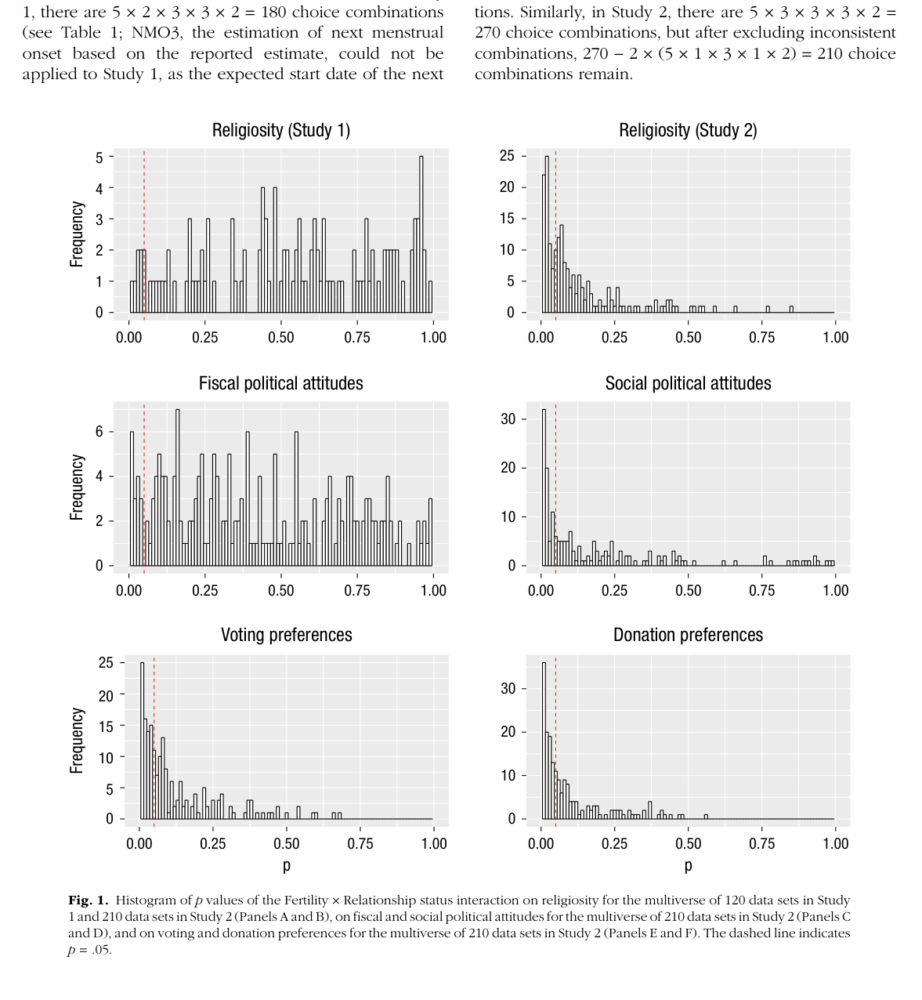
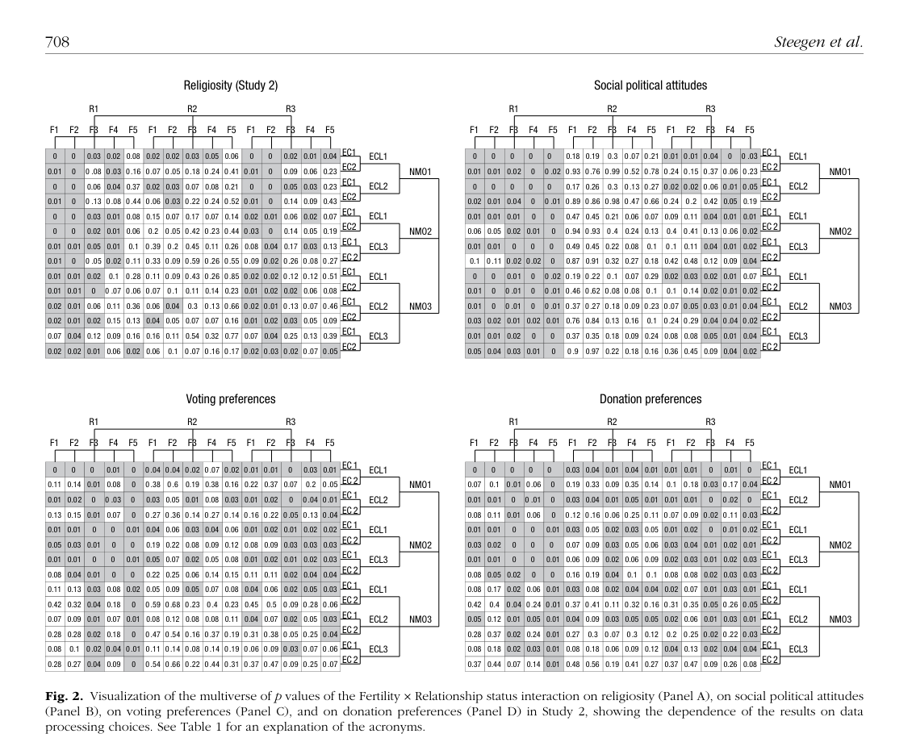

# Detailed Overview: *Increasing Transparency Through a Multiverse Analysis*

**Article:** Steegen, S., Tuerlinckx, F., Gelman, A., & Vanpaemel, W. (2016). *Increasing Transparency Through a Multiverse Analysis*. *Perspectives on Psychological Science*, 11(5), 702–712.  
**Core topic:** How researchers can make data-analysis decisions more transparent by analyzing all reasonable data-processing alternatives instead of reporting only one constructed dataset and one statistical result.

---

## 1. Central Argument

The article argues that empirical research almost always requires **data construction**: researchers must transform raw observations into an analyzable dataset. This process involves many choices, such as how to exclude cases, code variables, transform measures, dichotomize variables, or combine items into scales.

The authors’ main claim is that when several reasonable data-processing choices exist, analyzing only one constructed dataset can be misleading. A single reported result may appear decisive, but that result may be only one outcome from a much larger set of plausible analyses. The authors call this larger set the **data multiverse** and propose **multiverse analysis** as a method for making the robustness or fragility of findings visible.

A multiverse analysis asks:

> What would the statistical conclusion look like if the researcher had made other reasonable data-processing decisions?

The goal is not to find the “best” p-value. The goal is to expose how much the conclusion depends on arbitrary or under-justified analytic decisions.

---

## 2. Background: The Replication and Transparency Crisis

The article is situated in psychology’s broader crisis of confidence, including concerns about:

- **Questionable research practices**, such as selective reporting or undisclosed flexibility.
- **Implausible findings**, where statistically significant results appear unlikely or fragile.
- **Low reproducibility**, where many published effects fail to replicate.

The authors acknowledge existing reform proposals, including:

- Replication
- Higher statistical power
- Preregistration
- Clear separation of confirmatory and exploratory analyses
- Sharing data and materials
- Reporting all conditions and measures
- Bayesian methods
- Estimation-focused approaches instead of only null-hypothesis testing

They argue that these practices are valuable but incomplete. Even preregistered or transparently reported analyses may still depend on arbitrary data-processing decisions. A multiverse analysis provides an additional transparency tool by showing how results vary across reasonable processing choices.

---

## 3. Key Concept: Data Are Constructed, Not Merely Collected

A major conceptual contribution of the article is the distinction between **raw data** and **constructed datasets**.

Raw data are not automatically ready for analysis. Researchers usually need to process them by making decisions such as:

- Which observations to exclude
- How to handle missing or uncertain responses
- How to compute derived variables
- Whether to transform continuous variables
- Whether to split continuous variables into categories
- How to combine survey items into scales
- How to define groups or conditions

Each decision can have multiple defensible options. When these choices are combined, they create a **multiverse of possible datasets**.

For example, if a study involves 5 reasonable ways to define one variable, 3 ways to define another variable, and 2 exclusion rules, then there may be 5 × 3 × 2 = 30 reasonable datasets before any statistical model is even fitted.

The statistical result then inherits the arbitrariness of the data construction process. A p-value, effect size, confidence interval, or Bayes factor may look precise, but it may depend heavily on one arbitrary path through the data-processing workflow.

---

## 4. What Is a Multiverse Analysis?

A **multiverse analysis** involves performing the same research analysis across all reasonable versions of the dataset produced by alternative data-processing choices.

The authors describe it as a systematic extension of sensitivity analysis or outlier analysis. Instead of checking whether a result survives one alternate exclusion rule, a multiverse analysis checks whether the result survives a full set of reasonable processing decisions.

### Main Steps

1. **Identify the raw data.**  
   Begin with the same unprocessed observations.

2. **List reasonable data-processing choices.**  
   Identify every consequential decision point where multiple defensible options exist.

3. **Generate all reasonable combinations.**  
   Combine the options into a set of alternative processed datasets, excluding logically inconsistent combinations.

4. **Run the same analysis on each dataset.**  
   Use the same target statistical model or hypothesis test across the multiverse.

5. **Visualize and interpret the distribution of results.**  
   Examine whether conclusions are robust, fragile, or dependent on specific choices.

6. **Identify consequential choices.**  
   Determine which data-processing choices drive changes in the result.

---

## 5. Relationship to the “Garden of Forking Paths”

The article connects multiverse analysis to Gelman and Loken’s idea of the **garden of forking paths**.

The garden of forking paths refers to the many decisions researchers can make during analysis, often without consciously trying to manipulate the result. These choices create an implicit multiple-comparisons problem because the same theory can lead to many possible statistical tests depending on how the data are processed.

Multiverse analysis focuses on one important subset of the forking-paths problem: **data-processing choices**.

The authors emphasize that selective reporting is problematic even when researchers do not intentionally “p-hack.” If many reasonable paths exist but only one is reported, readers cannot know whether the result is robust or merely an artifact of one chosen path.

---

## 6. Demonstration Study: Fertility, Religiosity, and Political Attitudes

The authors demonstrate multiverse analysis using data from Durante, Rae, and Griskevicius (2013), who studied whether women’s fertility status was associated with religiosity and political attitudes, and whether the effect depended on relationship status.

The example was chosen to illustrate how a multiverse analysis works, not primarily to critique the original authors.

### Study 1

- **Participants:** 275 women
- **Measures:**
  - Three religiosity items on a 9-point scale
  - Typical menstrual cycle length
  - Start date of last menstrual period
  - Start date of previous menstrual period
  - Certainty ratings for those dates
  - Relationship status with four response options

### Study 2

- **Participants:** 502 women
- **Measures:**
  - Same fertility, religiosity, certainty, and relationship-status information as Study 1
  - Five fiscal political attitude items
  - Five social political attitude items
  - Voting preference: Mitt Romney or Barack Obama
  - Campaign donation preference: Mitt Romney or Barack Obama
  - Expected start date of next menstrual period

---

## 7. Original Single-Dataset Analysis

The original analysis constructed one dataset from the raw data using one set of processing choices.

### Processing Choices in the Single-Dataset Analysis

#### Religiosity
The three religiosity items were averaged into one religiosity score.

#### Fiscal and Social Political Attitudes
The five fiscal items were averaged into a fiscal political attitude score, and the five social items were averaged into a social political attitude score.

#### Fertility
Participants were divided into high- and low-fertility groups based on cycle day:

- High fertility: cycle days 7–14
- Low fertility: cycle days 17–25

Cycle day was calculated from the estimated timing of menstrual onset.

#### Relationship Status
Participants were grouped into:

- **Single:** response options 1 and 2
- **Committed relationship:** response options 3 and 4

This is important because response option 2, “dating or involved with only one partner,” is ambiguous. It could plausibly describe either single dating or a committed relationship.

#### Exclusions
Women outside the high- or low-fertility windows were excluded. No additional exclusion criteria were applied.

### Original Reported Results

Using this single constructed dataset, the original analysis found several significant Fertility × Relationship Status interactions:

- Religiosity in Study 1: significant interaction
- Religiosity in Study 2: significant interaction
- Social political attitudes: significant interaction
- Voting preference: significant interaction
- Donation preference: significant interaction
- Fiscal political attitudes: no significant fertility effect

These results suggested that fertility status was associated with religiosity and political attitudes differently for single women versus women in relationships.

---

## 8. Building the Data Multiverse

The authors then asked: what other reasonable datasets could have been constructed from the same raw data?

They identified five major data-processing choice points.

## 8.1 Fertility Classification

There were multiple reasonable ways to classify women as high or low fertility based on cycle day. The article lists five alternatives:

| Option | High fertility | Low fertility |
|---|---:|---:|
| F1 | Days 7–14 | Days 17–25 |
| F2 | Days 6–14 | Days 17–27 |
| F3 | Days 9–17 | Days 18–25 |
| F4 | Days 8–14 | Days 1–7 and 15–28 |
| F5 | Days 9–17 | Days 1–8 and 18–28 |

The original analysis used F1.

## 8.2 Estimating Next Menstrual Onset

Cycle day depends on estimating when the next menstrual period begins. The authors identified three reasonable options:

| Option | Method |
|---|---|
| NMO1 | Previous menstrual onset + computed cycle length |
| NMO2 | Previous menstrual onset + reported typical cycle length |
| NMO3 | Reported estimate of next menstrual onset |

NMO3 was available only in Study 2 because Study 1 did not collect expected next start date.

## 8.3 Relationship Status Coding

The article identifies three ways to dichotomize relationship status:

| Option | Single group | Relationship group |
|---|---|---|
| R1 | Response options 1 and 2 | Response options 3 and 4 |
| R2 | Response option 1 | Response options 2, 3, and 4 |
| R3 | Response option 1 | Response options 3 and 4; option 2 excluded |

The original analysis used R1.

The ambiguity of response option 2 is one of the most consequential features of the example.

## 8.4 Exclusion Based on Cycle Length

The authors considered three options:

| Option | Rule |
|---|---|
| ECL1 | No exclusion based on cycle length |
| ECL2 | Exclude participants with computed cycle length outside 25–35 days |
| ECL3 | Exclude participants with reported cycle length outside 25–35 days |

## 8.5 Exclusion Based on Certainty Ratings

The authors considered two options:

| Option | Rule |
|---|---|
| EC1 | No exclusion based on certainty ratings |
| EC2 | Exclude participants not sufficiently certain about at least one menstrual start date |

---

## 9. Number of Datasets in the Multiverse

The authors combined the reasonable choices and removed logically inconsistent combinations.

### Study 1

- Initial combinations: 5 × 2 × 3 × 3 × 2 = 180
- NMO3 was not available in Study 1
- After removing inconsistent combinations: **120 datasets**

### Study 2

- Initial combinations: 5 × 3 × 3 × 3 × 2 = 270
- After removing inconsistent combinations: **210 datasets**

Each dataset represented one plausible way the raw observations could have been processed.

---

## 10. Multiverse Results

After constructing the alternative datasets, the authors ran the same analyses across each version. They examined the p-values for the Fertility × Relationship Status interaction.

**Figure 1 summary:** The histograms show how the p-values vary across alternative datasets. The dashed vertical line marks p = .05. The key lesson is that the same raw data can produce very different conclusions depending on reasonable processing choices.

### 10.1 Religiosity, Study 1

The original single-dataset analysis found a significant interaction. However, the multiverse analysis showed that only **7 out of 120** processing combinations produced a significant result.

This means about **94%** of reasonable data-processing choices did *not* reproduce the significant finding.

The authors interpret this as evidence that the Study 1 religiosity result is highly fragile.

### 10.2 Fiscal Political Attitudes

Fiscal political attitudes showed a near-uniform distribution of p-values. Only about **8%** of the 210 combinations produced a significant interaction.

This suggests little consistent evidence for an effect in this outcome.

### 10.3 Religiosity, Study 2

For religiosity in Study 2, **88 out of 210** combinations, or about **42%**, produced p < .05.

This result is not simply robust or non-robust. Instead, the conclusion depends heavily on which processing choices are considered most defensible.

### 10.4 Social Political Attitudes

For social political attitudes, about **49%** of the p-values were below .05.

This indicates considerable ambiguity: roughly half the multiverse supports the interaction and half does not.

### 10.5 Voting and Donation Preferences

For voting preferences, about **46%** of p-values were below .05.  
For donation preferences, about **57%** were below .05.

These outcomes also show strong dependence on processing choices.

---

## 11. Visualizing Which Choices Matter

The authors use a detailed grid visualization to show which exact combinations of choices produce significant or nonsignificant results.

Multiverse grid showing p-values by processing-choice combination

**Figure 2 summary:** Each cell represents one combination of data-processing choices. Gray cells indicate p < .05, and white cells indicate p ≥ .05. The visualization helps identify which decisions are most responsible for changes in the conclusion.

### Key Patterns

#### Religiosity in Study 2

The way relationship status is coded matters strongly:

- R2 often leads to nonsignificant results.
- R1 and R3 more often produce significant results when paired with fertility options F1 and F2.
- F5 tends to produce nonsignificant results.

This indicates that both relationship-status coding and fertility classification influence the result.

#### Social Political Attitudes

Relationship-status coding is again highly consequential:

- R1 tends to produce significant results.
- R2 tends to produce nonsignificant results.
- R3 produces mixed results depending on other choices.

#### Voting and Donation Preferences

The patterns are harder to summarize. Multiple decisions appear to influence whether the result is significant. This means the outcome is not controlled by one obvious processing choice but by a broader interaction of decisions.

---

## 12. Interpretation: Robustness, Fragility, and Scientific Uncertainty

The article emphasizes that a multiverse analysis does not automatically tell researchers which conclusion is correct. Instead, it clarifies the status of the evidence.

### Robust Finding

A finding is more robust when most reasonable processing choices lead to the same conclusion.

### Fragile Finding

A finding is fragile when only a small subset of processing choices produce the reported result.

The Study 1 religiosity result is a clear example: the original significant result appears fragile because almost all alternative choices produce nonsignificant results.

### Ambiguous Finding

A finding is ambiguous when the multiverse is divided, with many significant and many nonsignificant results.

The Study 2 outcomes often fall into this category. The appropriate conclusion is not “there is definitely an effect” or “there is definitely no effect,” but rather:

> The data are not strong enough to support a stable conclusion unless researchers can justify why some processing choices are clearly superior.

---

## 13. Deflating the Multiverse

The authors introduce the idea of **deflating the multiverse**, which means reducing the number of reasonable analytic paths by improving theory, measurement, and study design.

### 13.1 Improve Measurement

In the example, the ambiguous relationship-status item created several plausible coding choices. A better-designed survey item could have avoided this ambiguity.

For example, instead of “dating or involved with only one partner,” the survey could separate casual dating from committed exclusive partnership. This would reduce arbitrary coding options.

### 13.2 Improve Theory

Different fertility-classification rules existed because the theoretical and measurement basis for identifying high versus low fertility was imprecise.

A stronger theory or better biological measurement could justify one method over others. The authors note that later recommendations favored assessing fertility through luteinizing hormone surges, ideally in within-subject designs.

### 13.3 Important Distinction

Deflating the multiverse does not mean hiding inconvenient alternatives. It means designing studies so that fewer arbitrary alternatives exist in the first place.

---

## 14. Why Preregistration Alone Is Not Enough

The article makes an important point: preregistration and blind analysis can prevent some forms of data-contingent decision-making, but they do not eliminate arbitrary data-processing choices.

### Preregistration

Preregistration forces researchers to choose analytic decisions before seeing the data. This is valuable because it limits opportunistic analysis after seeing results.

However, if the preregistered choices are still arbitrary, the analysis may still report only one branch of a larger multiverse.

### Blind Analysis

Blind analysis hides outcome labels or key results while researchers make analytic choices. This also reduces bias.

But, like preregistration, it still gives only one chosen path unless the researcher also examines other reasonable paths.

### Main Lesson

Preregistration and multiverse analysis solve different problems:

- Preregistration addresses data-contingent flexibility.
- Multiverse analysis addresses sensitivity to reasonable analytic alternatives.

They can and should be used together.

---

## 15. Subjectivity in Multiverse Analysis

The authors acknowledge that multiverse analysis is subjective because researchers must decide which processing choices are “reasonable.”

This subjectivity is unavoidable. However, the authors argue that it is better to make this judgment explicit than to hide it behind a single reported analysis.

A good multiverse analysis should include all plausible construction alternatives, not merely the alternatives that the researcher prefers.

However, not every possible option should be included. Choices that are indefensible, irrelevant, or clearly inappropriate do not need to be part of the multiverse.

---

## 16. Multiverse Analysis Is Not Limited to p-values

The example uses p-values because the original study used p-values. However, the authors stress that the logic of multiverse analysis is broader.

A multiverse analysis could examine the stability of:

- p-values
- Effect sizes
- Confidence intervals
- Credibility intervals
- Bayes factors
- Model coefficients
- Classification metrics
- Predicted probabilities

The key issue is not the inferential framework. The key issue is whether the conclusion changes across reasonable analytic choices.

---

## 17. Data Multiverse vs. Model Multiverse

The article mainly focuses on the **data multiverse**, meaning alternative ways to construct a dataset from raw observations.

However, the authors also discuss a **model multiverse**, where the same dataset could be analyzed using different reasonable statistical models.

Model-level choices include:

- ANOVA versus regression
- Linear versus nonlinear models
- Parametric versus nonparametric methods
- Different covariate specifications
- Different random-effects structures
- Different assumptions about residuals
- Main effects versus interaction models
- Different prior distributions in Bayesian models

A complete multiverse analysis could cross the data multiverse with the model multiverse, producing an even broader picture of analytic sensitivity.

---

## 18. What Multiverse Analysis Is Not

The authors clarify several limitations.

### It is not a formal test of misconduct

A multiverse analysis does not prove that researchers engaged in questionable research practices.

### It does not produce a single definitive evidential value

Unlike some statistical summaries, multiverse analysis is mainly descriptive and diagnostic.

### It does not automatically determine robustness thresholds

There is no universal rule such as “a finding is robust if 80% of analyses are significant.” Researchers and readers must interpret the pattern substantively.

### It does not replace better theory or measurement

If a multiverse reveals instability, the real solution may be better study design, better measurement, and clearer theoretical commitments.

---

## 19. Practical Workflow for Applying Multiverse Analysis

For a future data science or research project, the article’s method can be translated into this workflow:

1. **Start with raw data and document all preprocessing decisions.**
2. **Identify decision points where multiple choices are defensible.**
3. **Define a set of reasonable alternatives for each choice.**
4. **Exclude impossible or logically inconsistent combinations.**
5. **Create all resulting datasets programmatically.**
6. **Run the same analysis on each dataset.**
7. **Store results in a tidy table with one row per analytic path.**
8. **Visualize the distribution of results.**
9. **Map results back to processing choices to identify drivers of instability.**
10. **Report the full pattern, not only the most favorable result.**

A useful output table might include:

| Analysis ID | Fertility rule | Relationship coding | Exclusion rule | Model | Estimate | p-value | Conclusion |
|---:|---|---|---|---|---:|---:|---|
| 1 | F1 | R1 | ECL1, EC1 | ANOVA | ... | ... | Significant |
| 2 | F1 | R2 | ECL1, EC1 | ANOVA | ... | ... | Not significant |
| 3 | F2 | R1 | ECL2, EC2 | ANOVA | ... | ... | Significant |

---

## 20. Strengths of the Article

### 20.1 Clear Conceptual Contribution

The article provides a clear name and structure for a common problem: the fact that many reasonable data-processing choices can lead to many reasonable results.

### 20.2 Strong Demonstration

The fertility example makes the argument concrete. The original single result looked persuasive, but the multiverse analysis revealed that some conclusions were fragile or ambiguous.

### 20.3 Emphasis on Transparency Rather Than Accusation

The article does not frame multiverse analysis primarily as a way to catch bad actors. Instead, it frames it as a way to make analytic uncertainty visible.

### 20.4 Useful Visualizations

The histograms and grids show both the overall distribution of results and the specific processing choices that drive instability.

---

## 21. Limitations and Challenges

### 21.1 Defining “Reasonable” Choices Is Subjective

Researchers must decide which alternatives belong in the multiverse. Different researchers may draw the boundary differently.

### 21.2 Computational and Reporting Complexity

Some projects may involve many decision points, creating a very large number of analytic paths.

### 21.3 Interpretation Can Be Difficult

When results are mixed, researchers must decide how to summarize the evidence without oversimplifying.

### 21.4 It Can Reveal Problems Without Solving Them

A multiverse analysis may show that the evidence is fragile, but the fix may require a new study, better measures, or stronger theory.

---

## 22. Key Takeaways

- Empirical datasets are often **constructed** through researcher decisions rather than simply observed.
- Many data-processing decisions have multiple reasonable alternatives.
- A single reported analysis may hide the fact that other defensible choices would have produced different results.
- Multiverse analysis makes this hidden analytic uncertainty visible.
- The method helps distinguish robust findings from fragile or ambiguous ones.
- In the demonstration, some original significant findings became much less convincing once placed in the full multiverse of reasonable analyses.
- Multiverse analysis is compatible with preregistration, Bayesian methods, frequentist methods, and estimation-based reporting.
- The long-term goal is not just to run more analyses, but to improve theory, measurement, and design so fewer arbitrary choices are necessary.

---

## 23. Simple Summary

Steegen and colleagues argue that researchers should not report only one processed dataset and one statistical result when many reasonable preprocessing choices exist. Instead, they should analyze the whole “multiverse” of reasonable datasets. This reveals whether a conclusion is stable across analytic choices or whether it depends on one fragile path through the data. In their example, some findings that looked significant in a single analysis became weak or ambiguous when all reasonable preprocessing alternatives were considered.

---

## 24. Oral-Exam Style Explanation

A concise way to explain this article:

> A multiverse analysis is a transparency method for showing how much a research conclusion depends on data-processing decisions. Because raw data usually need to be transformed, coded, filtered, or combined before analysis, there are often several reasonable datasets that could be created from the same observations. Instead of reporting only one dataset and one result, researchers run the same analysis across all reasonable datasets. If the conclusion holds across most of the multiverse, it is more robust. If it appears only under a few processing choices, it is fragile. The method does not eliminate subjectivity, but it makes analytic uncertainty visible and helps identify which decisions matter most.

---

## 25. Connection to Data Science Practice

For applied data science, this article is relevant whenever preprocessing choices may affect conclusions, such as:

- Choosing missing-data rules
- Deciding outlier thresholds
- Binning continuous variables
- Selecting feature transformations
- Choosing fairness metrics
- Defining target labels
- Filtering time windows
- Choosing inclusion and exclusion criteria

In predictive modeling, the same idea can be used to evaluate whether model performance, feature importance, or subgroup conclusions are stable across reasonable preprocessing pipelines.

For example, if a healthcare risk model performs well only when one particular exclusion rule is used, that result should be reported as fragile. A multiverse analysis would make that fragility transparent.

